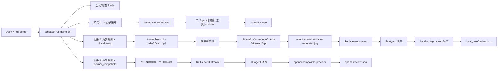
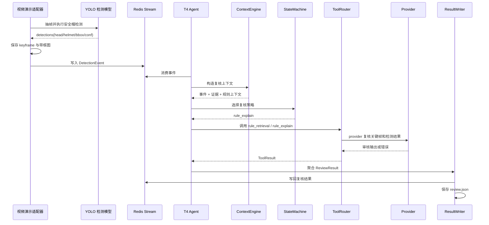

# T4 Agent 视频链路与 AI 复核演示汇报

> 汇报人：lzy
> 日期：2026-06-17
> 范围：T4 Agent 与知识复核主线
> 项目路径：`/home/lzy/work-code/ssv-private`

---

## 一、验收结论

T4 当前已经完成 Agent 侧复核闭环，能够从 Redis 事件消费开始，完成上下文构造、状态机决策、规则工具调用、模型 provider 复核、结构化结果回写和演示产物落盘。

本次演示不是只展示“视频接入”和“YOLO 模型能跑”，而是用真实视频和真实模型证明 T4 已经可以接住上游事件，并在 T4 内部完成复核闭环：

```text
视频/关键帧证据
  -> DetectionEvent
  -> Redis Stream
  -> T4 Agent 消费
  -> ContextEngine 构造上下文
  -> StateMachine 选择策略
  -> ToolRouter 调用规则工具
  -> provider 复核
  -> ReviewResult
  -> Redis / JSON 结果回写
```

本次一键演示命令为：

```bash
cd /home/lzy/work-code/ssv-private
./ssv t4-full-demo
```

本次真实运行结论：

| 阶段 | 状态 | 策略 | Provider | 说明 |
|:--|:--:|:--|:--|:--|
| T4 内部闭环 | `passed 2/2` | `visual_review / rule_explain` | `mock-text-provider` | 证明 T4 状态机、工具链、结果回写内部可闭环 |
| 真实视频 + 本地 YOLO | `completed` | `rule_explain` | `local-yolo-provider` | 真实视频抽帧后，T4 读取关键帧并调用本地模型复核成功 |
| 真实视频 + 外部 AI | `completed` | `rule_explain` | `openai-compatible-provider` | 外部 provider 已进入链路，但本次 API 读取超时，未拿到审核正文 |

需要特别说明：这次外部 AI provider 的审核正文没有成功返回。日志中的 AI 调用结果是：

```text
The read operation timed out
```

所以本次可以证明 `openai_compatible` 已接入 T4 provider 链路，但不能把这次外部 AI 阶段说成“AI 已成功给出审核结论”。真正成功返回审核文本的是本地 YOLO provider 阶段。

---

## 二、T4 完成度矩阵

| T4 能力项 | 状态 | 本次证据 |
|:--|:--:|:--|
| Redis 事件消费 | 已完成 | `event.json` 写入演示 Redis Stream 后被 Agent 消费 |
| 事件 schema 校验 | 已完成 | 视频检测事件转换为 `DetectionEvent` |
| 证据路径读取 | 已完成 | `evidence_paths` 指向 `keyframe.jpg` |
| 上下文构造 | 已完成 | `ContextEngine` 汇总事件、检测、证据和规则上下文 |
| 状态机编排 | 已完成 | `StateMachine` 选择 `rule_explain` 策略 |
| 工具路由 | 已完成 | `rule_retrieval` 与 `rule_explain` 被统一调度 |
| 本地模型 provider | 已完成 | `local-yolo-provider` 对关键帧二次复核成功 |
| 外部 AI provider | 已完成接入 | `openai-compatible-provider` 被调用，本次返回超时错误 |
| 结果聚合 | 已完成 | `ReviewResult` 记录终态、策略、工具结果和 provider |
| 结果回写 | 已完成 | 输出 `review.json`，并写回 Redis review stream |
| 失败可观测 | 已完成 | 外部 AI 超时被记录在 `tool_results[].error` |
| 一键演示 | 已完成 | `./ssv t4-full-demo` 生成 `summary.md` 和 `report.html` |

---

## 三、演示输入与输出目录

本次演示使用：

| 类型 | 路径或配置 |
|:--|:--|
| 演示视频 | `/home/lzy/work-code/30sec.mp4` |
| 本地安全帽模型 | `/home/lzy/work-code/comp-2-freeze10.pt` |
| 外部 AI provider | `openai_compatible` |
| 外部 AI 文本模型 | `qwen3.7-plus` |
| 输出目录 | `/home/lzy/work-code/ssv-private/output/t4-full-demo` |

本次输出产物：

| 产物 | 说明 |
|:--|:--|
| `output/t4-full-demo/summary.md` | 一键演示汇总，适合汇报时直接展示 |
| `output/t4-full-demo/report.html` | 图文演示页，脚本会尝试自动打开 |
| `output/t4-full-demo/local_yolo/keyframe.jpg` | 本地 YOLO 阶段原始关键帧 |
| `output/t4-full-demo/local_yolo/keyframe-annotated.jpg` | 本地 YOLO 阶段带框关键帧 |
| `output/t4-full-demo/local_yolo/event.json` | 写入 Redis 前的结构化事件 |
| `output/t4-full-demo/local_yolo/review.json` | 本地 YOLO provider 复核结果 |
| `output/t4-full-demo/openai/keyframe-annotated.jpg` | 外部 AI 阶段带框关键帧 |
| `output/t4-full-demo/openai/event.json` | 外部 AI 阶段结构化事件 |
| `output/t4-full-demo/openai/review.json` | 外部 AI provider 调用结果，含本次超时错误 |

---

## 四、本次实际演示结果

### 4.1 本地 YOLO provider

终端摘要：

```text
【真实视频 + 本地 YOLO provider】
  帧号: 75
  检测: 13 个 (head=1, helmet=12)
  终态: completed / 策略: rule_explain
  Provider: local-yolo-provider
  工具: rule_retrieval:ok, rule_explain:ok
```

本地 YOLO provider 给出的复核结果，也就是这次成功返回的模型审核文本：

```text
本地 YOLO 复核: 已佩戴安全帽，置信度=0.96。
关键帧中检测到 12 个 helmet 目标
关键观察: helmet conf=0.96；helmet conf=0.95；helmet conf=0.95；helmet conf=0.95；helmet conf=0.95；latency_ms=1181.9
```

对应文件：

```text
output/t4-full-demo/local_yolo/review.json
```

在 `review.json` 中，这段内容位于：

```text
tool_results[1].tool_name = rule_explain
tool_results[1].success = true
tool_results[1].output = 本地 YOLO 复核: 已佩戴安全帽...
provider_used = local-yolo-provider
```

### 4.2 外部 AI provider

终端摘要：

```text
【真实视频 + 外部 AI provider】
  帧号: 75
  检测: 13 个 (head=1, helmet=12)
  终态: completed / 策略: rule_explain
  Provider: openai-compatible-provider
  工具: rule_retrieval:ok, rule_explain:fail
  复核输出:
    The read operation timed out
```

对应文件：

```text
output/t4-full-demo/openai/review.json
```

这次外部 AI 的调用结果位于：

```text
tool_results[1].tool_name = rule_explain
tool_results[1].success = false
tool_results[1].output = ""
tool_results[1].error = The read operation timed out
provider_used = openai-compatible-provider
```

结论：外部 AI provider 已被 T4 状态机调度并进入链路，但本次外部 API 在读取响应时超时，所以没有拿到可展示的外部 AI 审核正文。汇报时建议如实说明“外部 AI 接口已接入，现场网络/API 响应超时，失败信息已结构化记录到结果中”。

---

## 五、链路路径图

### 5.1 整体演示路径



### 5.2 T4 内部数据流



### 5.3 文件路径流转

```text
/home/lzy/work-code/30sec.mp4
  -> output/t4-full-demo/local_yolo/keyframe.jpg
  -> output/t4-full-demo/local_yolo/keyframe-annotated.jpg
  -> output/t4-full-demo/local_yolo/event.json
  -> Redis: ssv:t4-video-demo:events:*
  -> T4 Agent
  -> output/t4-full-demo/local_yolo/review.json
  -> Redis: ssv:t4-video-demo:reviews:*
```

外部 AI 阶段使用相同路径结构：

```text
output/t4-full-demo/openai/event.json
  -> Redis event stream
  -> T4 Agent
  -> openai-compatible-provider
  -> output/t4-full-demo/openai/review.json
```

---

## 六、哪个是 AI 回复的审核结果

在当前 T4 结果结构里，provider 的审核结果不看 `conclusion`，而是看 `review.json` 里的工具结果：

```text
tool_results[] 中 tool_name = rule_explain 的那一项
```

本次本地 YOLO 阶段：

```text
文件: output/t4-full-demo/local_yolo/review.json
位置: tool_results[1].output
结果: 本地 YOLO 复核: 已佩戴安全帽，置信度=0.96...
```

本次外部 AI 阶段：

```text
文件: output/t4-full-demo/openai/review.json
位置: tool_results[1].error
结果: The read operation timed out
```

也就是说：

| 问题 | 回答 |
|:--|:--|
| 本地模型审核结果在哪里 | `local_yolo/review.json -> tool_results[1].output` |
| 外部 AI 审核结果在哪里 | 正常情况下在 `openai/review.json -> tool_results[1].output` |
| 这次外部 AI 回复了什么 | 没有返回审核正文，返回了超时错误 `The read operation timed out` |
| `conclusion` 是不是 AI 原文 | 不是，它是 T4 聚合后的规则解释结论 |

---

## 七、现场演示步骤

现场优先使用一键演示：

```bash
cd /home/lzy/work-code/ssv-private
./ssv t4-full-demo
```

执行后优先展示：

```bash
cat output/t4-full-demo/summary.md
xdg-open output/t4-full-demo/report.html
xdg-open output/t4-full-demo/local_yolo/keyframe-annotated.jpg
cat output/t4-full-demo/local_yolo/review.json
cat output/t4-full-demo/openai/review.json
```

如果希望现场有视频窗口，可以补充展示 OpenCV 实时检测窗口：

```bash
/home/lzy/work-code/ssv-private/output/t4-demo/run_live_yolo.sh
```

该窗口会实时播放 `/home/lzy/work-code/30sec.mp4`，并用红框标出不戴头盔/head，用绿框标出 helmet，按 `q` 或 `ESC` 退出。

---

## 八、汇报话术

建议按下面这段讲：

> 这次演示验证的是我负责的 T4 Agent 复核链路。视频和 YOLO 负责产生检测事件和关键帧证据，真正属于 T4 的部分是：消费 Redis 事件、校验事件结构、读取证据路径、构造上下文、通过状态机选择复核策略、调用规则工具和模型 provider，最后生成结构化 ReviewResult 并回写。
>
> 从本地模型演示结果看，第 75 帧检测到 13 个目标，其中 12 个 helmet、1 个 head。T4 最终状态为 `completed`，策略为 `rule_explain`，provider 为 `local-yolo-provider`。复核阶段重新读取关键帧并调用本地 YOLO，返回“已佩戴安全帽，置信度 0.96”，说明 T4 的证据读取、模型复核、工具编排和结果回写已经闭环。
>
> 外部 AI provider 也已经接入同一条 T4 链路，本次状态机实际调度到了 `openai-compatible-provider`，但是外部接口读取超时，因此 `review.json` 中记录了 `The read operation timed out`。这说明链路可观测和失败记录已经具备，后续只要 API 网络和模型响应稳定，就能在同一位置拿到外部 AI 的审核正文。

如果需要解释为什么策略是 `rule_explain`：

> 第 75 帧同时检测到了 `helmet` 和 `head`，属于需要结合安全规则解释的场景，因此状态机选择 `rule_explain`。这不是失败，而是 T4 按策略完成规则检索和 provider 复核后的完成态。

---

## 九、当前边界

本次演示是“视频输入演示适配器 + T4 Agent 复核闭环”，不是完整生产级实时链路。

已经完成并可演示的 T4 能力：

1. Redis 事件消费。
2. 事件 schema 校验。
3. 关键帧证据路径读取。
4. ContextEngine 上下文构造。
5. StateMachine 策略选择。
6. ToolRouter 工具调用。
7. `local_yolo` 本地模型 provider。
8. `openai_compatible` 外部 AI provider。
9. ReviewResult 结果聚合。
10. Redis / JSON 结果回写。
11. provider 失败或超时时结构化记录错误。

仍需 T1/T2/T3 后续合流的部分：

1. 生产级 GStreamer 实时视频输入。
2. C++ 推理插件中的真实安全帽模型接入。
3. 跟踪、事件判定和证据输出的正式链路。
4. 长期运行时状态观测、错误码和运行报告。

因此，本次演示可以作为 T4 主线完成度证明：T4 已经准备好接收上游事件和证据，并能完成知识复核、模型复核、AI provider 调用、失败可观测和结果回写。

---

## 十、验证记录

本次用户实际执行：

```text
./ssv t4-full-demo
```

结果摘要：

```text
阶段 1/3: T4 内部闭环
结果: passed 2/2

阶段 2/3: 真实视频 + 本地 YOLO provider
结果: completed / rule_explain / local-yolo-provider
检测: 13 个 (head=1, helmet=12)
复核输出: 本地 YOLO 复核: 已佩戴安全帽，置信度=0.96

阶段 3/3: 真实视频 + 外部 AI provider
结果: completed / rule_explain / openai-compatible-provider
工具结果: rule_retrieval:ok, rule_explain:fail
错误: The read operation timed out
```

此前代码验证记录：

```text
cd agent && uv run --extra dev --extra vision pytest -q
结果：141 passed
```

```text
cd agent && uv run --extra dev --extra vision ruff check src tests
结果：All checks passed
```

```text
bash tests/ssv_cli_test.sh
结果：通过
```

```text
output/t4-demo/run_live_yolo.sh --no-display --max-frames 10
结果：成功生成 OpenCV YOLO 标注视频、最新帧和首个不戴头盔截图
```
