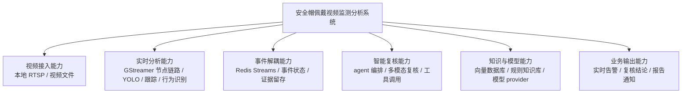
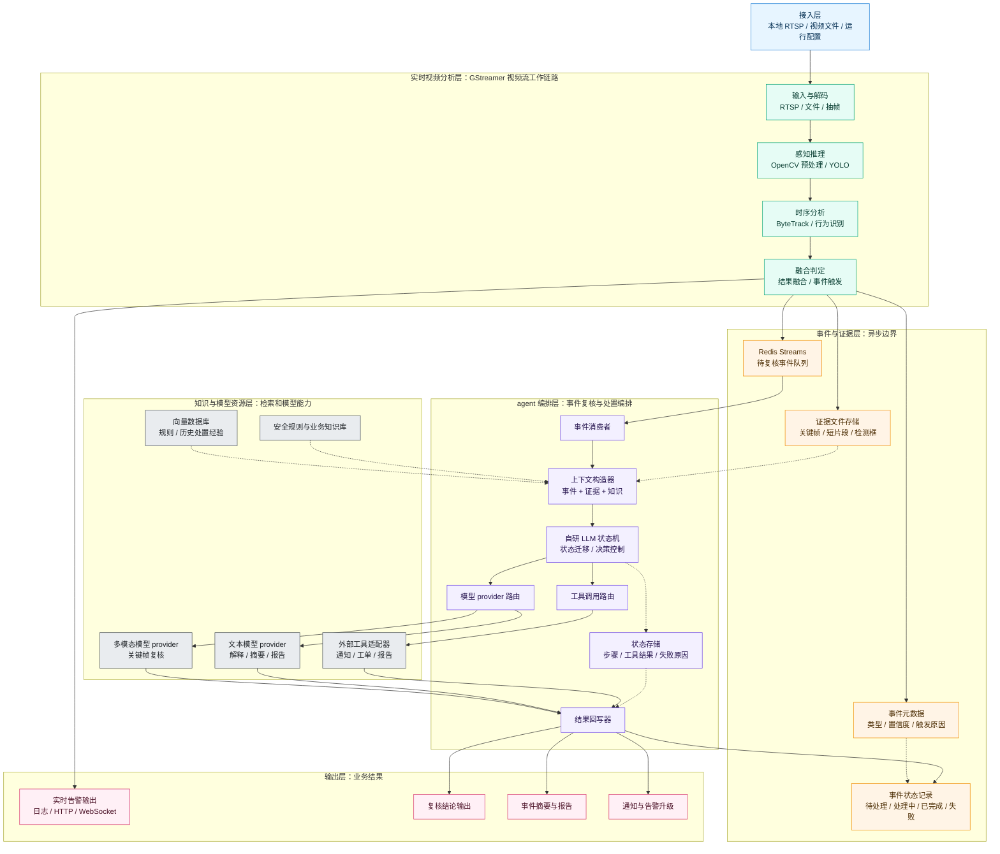
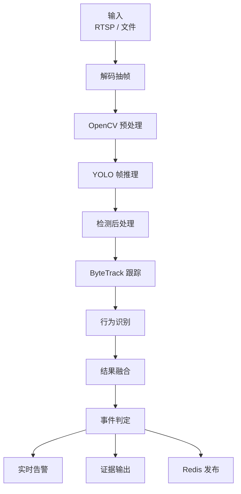
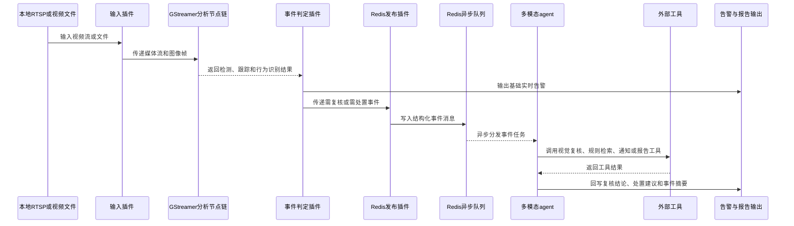
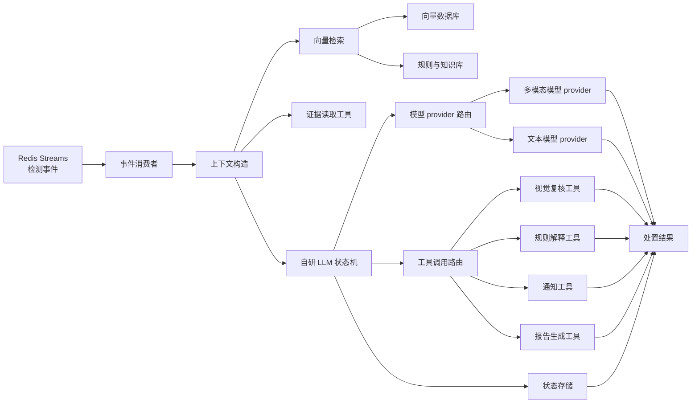

# 安全帽佩戴视频监测分析系统设计

## 背景

本系统面向安全帽佩戴检查的视频监测场景，第一阶段目标是先完成可落地的单机原型架构设计。视频源优先按本地 `RTSP` 或视频文件考虑，通过 `GStreamer` 构建实时视频分析主链路，结合 `YOLO` 安全帽检测模型识别人员、安全帽和未佩戴安全帽等目标。

多模态工具调用型 agent 不进入每帧同步检测链路。系统只在检测到违规、低置信度或需要复核的事件时，通过 `Redis` 异步队列触发 agent 工作流，由 agent 处理关键帧复核、事件解释、规则检索、告警升级和报告生成。

## 目标

第一阶段设计目标如下：

1. 明确单机原型的总体架构。
2. 明确 `GStreamer` 插件化工作流的组织方式。
3. 明确 `GStreamer + YOLO` 的实时检测主链路。
4. 明确 `Redis` 作为检测事件与 agent 工作流之间的异步边界。
5. 明确软件层级架构。
6. 明确 agent 的自研 LLM 状态机编排、工具调用、模型 provider 和向量数据库边界。
7. 输出总体架构图、插件化工作流图、软件层级图、agent 架构图和事件触发工作流图。
8. 给出第一阶段技术栈选型。
9. 明确当前阶段不展开的模块内部细节。

## 范围

本阶段包含：

1. 本地 `RTSP` 或视频文件输入。
2. `GStreamer` 插件化工作流的整体组织。
3. `GStreamer` 视频接入、解码、抽帧、`OpenCV` 预处理、`YOLO` 推理、`ByteTrack` 跟踪、行为识别和事件判定的整体职责。
4. `YOLO` 安全帽佩戴检测。
5. 检测、跟踪、行为识别结果到结构化事件的转换。
6. `Redis` 异步队列触发 agent 工作流。
7. 多模态 agent 的整体职责边界、自研 LLM 状态机编排边界、模型 provider 边界和向量数据库边界。
8. 软件层级架构。

本阶段不包含：

1. `GStreamer` 插件源码内部实现和完整 pipeline 语句。
2. `YOLO` 数据集、训练、评估和模型调优流程。
3. agent 工具调用 schema 和提示词细节。
4. 前端页面设计。
5. 数据库表结构。
6. `WVP`、`ZLMediaKit` 等平台级接入和设备管理。
7. 大规模多路视频调度、集群部署和高可用治理。
8. 完整 agent 框架实现和工具协议源码。

## 总体架构

总体架构采用按功能能力分层的表达方式，不在总图中描述流程细节。系统由视频接入能力、实时分析能力、事件解耦能力、智能复核能力、知识与模型能力、业务输出能力组成。实时分析能力仍是第一阶段主链路，具体节点链路在“软件层级架构”和“GStreamer 插件化工作流”章节说明。

`Redis` 是异步边界，避免 agent 的大模型调用、工具调用或外部系统响应时间影响实时检测吞吐。

agent 的定位是事件复核与处置编排，不是实时检测引擎。它消费已经结构化的检测事件和证据文件，根据事件严重程度、置信度和触发原因决定是否调用视觉复核、规则检索、通知或报告工具。

## 软件层级架构

软件层级上，系统分为接入层、实时视频分析层、事件与证据层、agent 编排层、知识与模型资源层、输出层。为保持总览图紧凑，实时视频分析层在本图中折叠为输入与解码、感知推理、时序分析、融合判定四个阶段；`OpenCV` 预处理、`YOLO` 帧推理、`ByteTrack` 跟踪、行为识别等详细节点在“GStreamer 插件化工作流”章节展开。事件与证据层负责沉淀事件元数据、证据文件、异步队列和处理状态。agent 编排层负责消费事件、构造上下文、路由模型与工具，并把复核结果写回。知识与模型资源层提供向量检索、规则知识、多模态模型、文本模型和外部工具适配。输出层承载实时告警、复核结论、报告和通知。

事件与证据层是两个链路的交界面：`Redis Streams` 负责异步任务分发，证据文件存储负责提供关键帧和短片段，事件记录负责保留结构化元数据。第一阶段可以先用文件系统保存证据，用轻量事件记录表达元数据；长期数据库设计不在本阶段展开。

## GStreamer 插件化工作流

插件化工作流的拆分原则是：媒体处理、图像预处理、目标检测、目标跟踪、行为识别、事件判定和异步发布分离。这样第一阶段可以先用最小插件链跑通单机原型，后续再替换输入源、推理后端、跟踪算法、行为识别算法或输出通道，而不需要重写整条分析链路。

建议的插件边界如下：

| 插件 | 主要职责 | 输入 | 输出 |
| --- | --- | --- | --- |
| 输入插件 | 读取本地 `RTSP` 或视频文件，处理基础连接状态 | 视频源地址或文件路径 | 原始媒体流 |
| 解码抽帧插件 | 解码视频流，按配置输出分析帧 | 原始媒体流 | 图像帧 |
| `OpenCV` 预处理插件 | 完成缩放、颜色格式转换、ROI 裁剪、归一化等推理前处理 | 图像帧 | 模型输入张量或标准图像帧 |
| `YOLO` 推理插件 | 调用安全帽检测模型，输出人员、安全帽和未佩戴安全帽检测结果 | 模型输入 | 检测框、类别、置信度 |
| 检测后处理插件 | 做置信度过滤、类别映射和检测框整理 | 原始检测结果 | 标准检测元数据 |
| `ByteTrack` 跟踪插件 | 基于检测框进行多目标跟踪，生成稳定目标 ID 和轨迹 | 标准检测元数据 | 目标 ID、轨迹、跨帧状态 |
| 行为识别插件 | 基于轨迹、区域和时序特征识别停留、越界、异常动作等行为 | 目标轨迹和图像帧 | 行为标签、行为置信度 |
| 结果融合插件 | 融合检测、跟踪和行为识别结果，形成统一分析结果 | 检测元数据、轨迹、行为标签 | 融合后的分析元数据 |
| 事件判定插件 | 根据连续命中、阈值、区域规则、行为结果和冲突规则生成事件 | 分析元数据 | 结构化事件 |
| 实时告警输出插件 | 输出基础实时状态和告警 | 结构化事件 | 日志、`HTTP` 或 `WebSocket` 消息 |
| 证据输出插件 | 保存关键帧、检测框和可选短片段 | 结构化事件和图像帧 | 证据文件路径 |
| `Redis` 发布插件 | 将需复核或需处置的事件写入 `Redis Streams` | 结构化事件和证据路径 | 异步事件消息 |

第一阶段不要求每个边界都实现为独立二进制插件，但设计上应按这些职责拆分。实现时可以先用进程内插件、动态库插件或明确命名的 pipeline 元件组合表达边界，后续再根据性能和复用需求固化为正式 `GStreamer` 插件。

## 事件触发工作流

事件进入 `Redis` 的触发条件建议包括：

1. 检测到人员未佩戴安全帽。
2. 安全帽或人员检测置信度低于阈值，需要二次复核。
3. 同一目标或同一区域连续多帧命中违规条件。
4. 规则判定出现冲突，例如人员框存在但安全帽框不稳定。
5. 需要生成事件说明、通知或报告。

## agent 架构设计

agent 架构采用事件驱动编排。事件消费者从 `Redis Streams` 读取检测事件，自研 LLM 状态机根据事件类型、严重程度、置信度和证据可用性决定后续步骤。状态机不直接绑定某一个模型或工具，而是通过模型 provider 路由和工具调用路由访问能力。

agent 内部建议拆分为以下层级：

| 层级 | 职责 | 第一阶段边界 |
| --- | --- | --- |
| 事件消费者 | 从 `Redis Streams` 获取待复核事件，处理消费确认和失败状态 | 只定义消费职责和状态边界，不设计完整重试策略 |
| 自研 LLM 状态机 | 决定事件是否需要复核、检索、通知或报告，并控制状态迁移 | 只定义状态与边界，不展开提示词和源码实现 |
| 状态存储 | 保存当前状态、工具调用结果、失败原因和最终结论 | 只定义需要持久化的状态类型，不设计数据库表 |
| 上下文构造 | 汇总事件元数据、关键帧路径、检测框、规则片段和历史知识 | 只定义上下文来源，不展开 prompt 模板 |
| 工具调用路由 | 根据任务类型调用视觉复核、规则解释、通知和报告工具 | 只定义工具类别，不展开工具 schema |
| 模型 provider 路由 | 屏蔽具体模型厂商和部署形态 | 只定义 provider 抽象，不指定唯一厂商 |
| 向量检索 | 从规则、制度、历史处置经验中检索相关上下文 | 只定义向量数据库职责，不设计索引细节 |
| 结果输出 | 输出复核结论、处置建议、事件摘要和报告 | 只定义输出类型，不设计前端展示 |

### 编排边界

自研 LLM 状态机负责把一个检测事件转换成可执行的复核流程。建议第一阶段只定义四类流程：

1. 直接确认：高置信度未佩戴安全帽事件，输出结论和摘要。
2. 视觉复核：低置信度、遮挡或检测冲突事件，调用多模态模型复核关键帧。
3. 规则解释：需要结合安全规则或业务制度解释的事件，调用向量检索和规则解释工具。
4. 通知报告：达到严重程度阈值的事件，生成通知内容或事件报告。

状态机不得把 agent 变成实时检测链路的一部分。视频帧是否继续处理，只由 `GStreamer` 插件化工作流决定；agent 的处理延迟只影响复核和报告结果，不影响实时检测。

### 自研 LLM 状态机

自研状态机用于约束 agent 的运行路径，避免把事件复核做成开放式对话。第一阶段建议状态集合如下：

1. 待消费：事件仍在 `Redis Streams` 中等待消费。
2. 事件解析：读取事件元数据、证据路径和触发原因。
3. 上下文构造：汇总检测结果、关键帧、规则片段和历史知识。
4. 策略选择：判断走直接确认、视觉复核、规则解释、通知报告或人工复核。
5. 工具调用：通过工具调用路由执行受控工具。
6. 结果汇总：合并模型输出、工具结果和规则解释。
7. 结果回写：写回事件状态、复核结论、报告或通知内容。
8. 完成、失败、待人工复核：收敛为终态。

LLM 在状态机中只负责辅助决策、解释生成和报告生成，不直接修改事件状态，不直接发送通知，也不绕过工具调用路由访问外部系统。

### 工具调用边界

第一阶段采用标准化 tool calling 思路，但只定义内部协议边界，不实现完整 schema。所有工具调用都应经过工具调用路由完成参数校验、权限控制、超时控制和失败状态记录。工具分为：

1. 证据读取工具：读取关键帧、检测框和短片段路径。
2. 视觉复核工具：调用多模态模型判断是否佩戴安全帽，并给出解释。
3. 规则解释工具：结合安全规则、项目制度和历史处置经验生成说明。
4. 通知工具：生成告警升级内容，后续可对接短信、企业微信或工单系统。
5. 报告工具：生成事件摘要、复核结论和处置建议。

工具调用的内部抽象可以统一为“工具名 + 参数 + 调用上下文 + 返回结果 + 错误信息”。模型 provider 可以生成工具调用意图，但不能直接执行工具；真正执行必须由工具调用路由完成。

### 模型 provider 边界

模型 provider 层用于屏蔽具体模型来源。第一阶段建议抽象为两类：

1. 多模态模型 provider：接收关键帧和事件上下文，输出视觉复核结论。
2. 文本模型 provider：接收规则片段、事件上下文和工具结果，输出解释、摘要或报告。

provider 可以对应本地模型服务、云端模型 API 或离线推理服务。设计上不把业务流程绑定到单一 provider，避免后续更换模型时影响 agent 编排逻辑。

### 状态机实现选型

第一阶段架构主线采用自研轻量 LLM 状态机，因为当前事件类型固定、状态边界清楚、工具调用需要强约束，直接自研更容易控制审计、失败回写和人工复核。实现计划中可以保留以下替代方案作为评估项：

1. `LangGraph`：适合复杂图编排、状态持久化和可视化调试增强的场景。
2. `LlamaIndex Workflows`：适合知识库、向量检索和 RAG 比重更高的 agent 工作流。
3. `Semantic Kernel` 或 `Microsoft Agent Framework`：适合企业集成、插件治理和多 agent 编排更重的场景。

除非后续出现复杂多分支编排、跨会话恢复、多 agent 协作或平台集成要求，否则第一版不引入这些框架作为强依赖。

### 向量数据库边界

向量数据库用于存储和检索安全规则、作业规范、历史处置经验和场景知识。第一阶段只要求明确它在 agent 中的位置：

1. 输入：规则文档、制度条款、历史事件摘要等文本知识。
2. 输出：与当前事件相关的规则片段、相似案例和处置建议来源。
3. 消费方：上下文构造和规则解释工具。

向量数据库不用于存储实时视频帧，也不替代事件库。事件记录、证据文件和知识检索需要保持边界清晰。

## 事件数据边界

第一阶段只需要定义 agent 能消费的最小事件信息，不设计完整数据库结构。事件消息建议包含：

| 字段 | 含义 |
| --- | --- |
| `event_id` | 事件唯一标识 |
| `source_id` | 视频源标识 |
| `timestamp` | 事件时间 |
| `event_type` | 事件类型，例如未佩戴安全帽、低置信度复核 |
| `detections` | 检测框、类别、置信度 |
| `tracks` | 目标 ID、轨迹和跨帧状态 |
| `behaviors` | 行为识别标签、行为置信度和区域规则命中情况 |
| `fusion_result` | 检测、跟踪和行为识别融合后的分析结果 |
| `frame_path` | 关键帧路径 |
| `clip_path` | 可选短视频片段路径 |
| `trigger_reason` | 进入 agent 队列的原因 |
| `severity` | 事件严重程度 |
| `agent_state` | agent 状态机当前状态，例如待消费、处理中、完成、失败、待人工复核 |
| `tool_results` | 可选工具调用结果摘要 |

这些字段用于保证 agent 可以追溯原始检测证据，并且能根据事件类型选择合适工具。长期事件存储、查询索引和统计报表不属于第一阶段。

## 技术栈选型

| 层级 | 选型 | 说明 |
| --- | --- | --- |
| 视频输入 | 本地 `RTSP`、视频文件 | 适合单机原型快速验证，不依赖平台级接入 |
| 视频分析框架 | `GStreamer` | 作为实时视频分析主框架，按插件化工作流承载接入、解码、抽帧、预处理、推理、跟踪、行为识别、事件判定和输出 |
| 工作流组织 | `GStreamer` 插件链 | 用插件边界隔离输入、解码、`OpenCV` 预处理、`YOLO` 推理、后处理、`ByteTrack` 跟踪、行为识别、结果融合、事件判定、证据输出和 `Redis` 发布 |
| 图像预处理 | `OpenCV` | 用于缩放、颜色格式转换、ROI 裁剪、归一化等帧级处理 |
| 目标检测模型 | `YOLO` 安全帽检测模型 | 用于识别人员、安全帽和未佩戴安全帽目标 |
| 多目标跟踪 | `ByteTrack` | 用于基于检测框生成稳定目标 ID、轨迹和跨帧状态 |
| 行为识别 | 规则识别优先，后续可接动作识别模型 | 第一阶段用于区域停留、越界、异常动作等基于轨迹和区域的行为判断 |
| 推理运行时 | `ONNX Runtime` 优先，后续按硬件选择 `TensorRT` 或 `OpenVINO` | 第一阶段保持部署简单，后续可按硬件优化 |
| 异步队列 | `Redis Streams` | 适合表达可消费、可确认、可追踪的事件流 |
| agent 编排服务 | `Python` 服务 | 便于组织事件消费、上下文构造、自研 LLM 状态机、工具调用、模型 provider 路由和结果输出 |
| agent 编排方式 | 自研 LLM 状态机 | 用固定状态约束事件复核流程，降低通用 agent 框架的不确定性 |
| 工具调用方式 | 标准化内部 tool calling 协议 | 通过工具调用路由统一参数校验、权限控制、超时和失败状态记录 |
| 向量数据库 | `Milvus`、`Qdrant` 或 `pgvector` | 用于检索安全规则、历史处置经验和业务知识，具体选型后续按部署复杂度决定 |
| 多模态复核 | 支持图像输入的视觉语言模型 | 用于低置信度和复杂场景复核 |
| 文本模型 provider | 本地模型服务或云端模型 API | 用于事件解释、报告生成和通知内容生成 |
| 输出接口 | 日志、`HTTP`、`WebSocket` | 第一阶段用于观察实时告警和 agent 处置结果 |

## 错误处理原则

1. 视频源断开时，实时检测链路应记录状态并尝试重连，不触发 agent。
2. `YOLO` 推理失败时，记录帧级错误并跳过当前帧，不阻塞后续视频处理。
3. `Redis` 不可用时，实时检测链路仍应保留基础告警输出，并记录事件入队失败。
4. agent 调用工具失败时，事件应保留失败状态和错误原因，避免重复无界重试。
5. LLM 状态机迁移失败时，事件应进入失败或待人工复核状态，不应停留在处理中。
6. 模型 provider 不可用时，agent 应输出待复核状态，不应伪造模型结论。
7. 向量数据库不可用时，agent 可以跳过规则检索，但输出中应标明缺少知识上下文。
8. 关键帧或短片段缺失时，agent 只能输出低置信度结论，不应伪造复核结果。

## 验证方式

第一阶段验证以架构可跑通为主：

1. 使用本地视频文件验证输入插件、解码抽帧插件可以稳定输出图像帧。
2. 验证 `OpenCV` 预处理节点可以输出符合推理输入要求的帧。
3. 使用测试图片或视频帧验证 `YOLO` 推理插件可以输出安全帽相关检测结果。
4. 使用连续帧验证 `ByteTrack` 跟踪插件可以生成稳定目标 ID 和轨迹。
5. 使用区域规则或时序规则验证行为识别插件可以输出行为标签。
6. 构造未佩戴安全帽、越界或低置信度事件，验证事件判定插件可以生成结构化事件。
7. 验证证据输出插件可以保存关键帧、检测框和轨迹信息。
8. 验证 `Redis` 发布插件可以写入 `Redis Streams`。
9. 构造 agent 消费流程，验证可以从 `Redis` 读取事件并访问关键帧。
10. 用模拟状态机验证事件可以从待消费迁移到完成、失败或待人工复核状态。
11. 用模拟模型 provider 验证 agent 可以完成视觉复核流程。
12. 用模拟向量检索结果验证 agent 可以把规则片段纳入事件解释。
13. 用模拟工具调用验证 agent 可以输出复核结论和事件摘要。

## 后续演进

第一阶段完成后，再按实际需要展开：

1. 接入 `WVP`、`ZLMediaKit` 或其他视频平台。
2. 设计多路视频调度和资源隔离。
3. 细化 `GStreamer` pipeline 和硬件加速方案。
4. 设计 agent 工具调用 schema。
5. 增加前端控制台和事件检索页面。
6. 建立长期事件库、证据库和统计报表。
