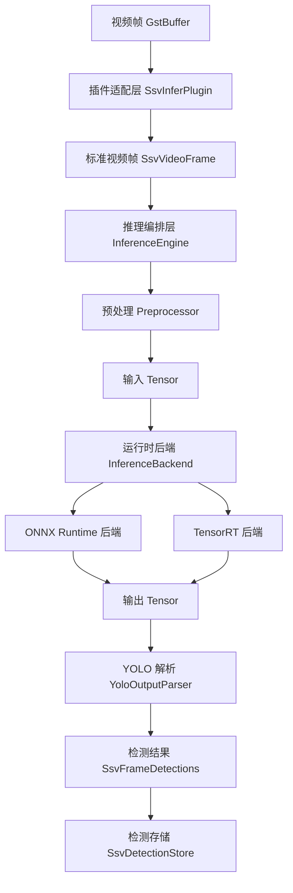

# T2 推理运行时解耦设计 spec

## 背景

当前 `gst/ssv-infer` 同时承担 GStreamer 插件适配、ONNX Runtime 会话创建、CPU/CUDA provider 选择、图像预处理、模型输出 shape 判断、YOLO 输出解析、NMS 和检测结果写入职责。插件结构中直接持有 `Ort::Env`、`Ort::Session` 和 `Ort::MemoryInfo`，单帧推理路径也直接构造 ONNX tensor 并调用 `Ort::Session::Run()`。

这种结构能支撑单一 ONNX Runtime 链路，但不适合继续扩展 TensorRT。TensorRT 引入后，如果继续把后端 API 堆进 `gstssvinfer.cpp`，插件会同时理解 GStreamer、ONNX Runtime、TensorRT、CUDA buffer、YOLO 输出格式和业务检测契约，后续测试和替换都会变得困难。

本阶段属于 `T2` 感知算法与元数据主线。改动会影响 `gst/ssv-infer` 的内部结构、插件属性、YAML 配置、Meson 可选依赖和 C++ 测试。由于 YAML 配置和插件属性属于跨主线接口，本 spec 先冻结新契约，再进入实现。

## 目标

1. 将推理运行时从 `ssv-infer` 插件中解耦，使插件不再直接调用 ONNX Runtime 或 TensorRT API。
2. 至少支持 `onnxruntime` 和 `tensorrt` 两类运行时后端。
3. 支持通用的 `cpu`、`gpu` 和 `auto` 设备选择语义。
4. 重新设计推理配置，不在 YAML 中出现 `cuda-*` 等后端专属配置项。
5. 将预处理、shape 校验、YOLO 输出解析和 runtime 后端边界拆成清晰可读的 C++ 类。
6. TensorRT 作为可选构建能力接入，不要求所有开发环境安装 TensorRT SDK。
7. 用分层验收保证无 TensorRT 环境也能完成默认构建和 ONNX Runtime CPU 测试。

## 范围

本阶段包含：

1. 重构 `gst/ssv-infer` 内部结构，将 GStreamer 适配层、推理编排层、运行时后端层分离。
2. 新增统一 tensor、模型 metadata、runtime 配置和后端接口类型。
3. 将 ONNX Runtime 调用迁移到 `OnnxRuntimeBackend`。
4. 新增 `TensorRtBackend` 设计和可选构建接入；有 TensorRT SDK 时可构建和运行 `.engine`。
5. 将 YOLO 输出解析从 runtime 后端中独立出来，保留对 `yolov5`、`yolov8` 和 `yolo_nx6` 输出格式的支持。
6. 将图像预处理独立为类，但仍由 `ssv-infer` 插件内部调用，不拆成独立 GStreamer 插件。
7. 重写 YAML 推理配置和插件属性契约，删除旧的 CUDA 专属字段。
8. 补充配置校验、后端选择、无 TensorRT 构建和 parser 的自动测试。

本阶段不包含：

1. 不在 C++ 插件中把 `.onnx` 构建成 TensorRT `.engine`。
2. 不引入插件间 tensor caps、tensor metadata 或独立预处理 GStreamer 插件。
3. 不做 GPU 零拷贝或 device tensor 跨层传递。
4. 不引入多模型级联、分割、姿态或分类模型的完整业务解析。
5. 不评估模型准确率和 TensorRT 性能收益。
6. 不保留旧 YAML 字段兼容行为。

## 总体架构

推理链路拆为三层：

1. `SsvInferPlugin` 是 GStreamer 适配层，只处理插件生命周期、属性、buffer 提取、异步 worker 和检测结果写入。
2. `InferenceEngine` 是推理编排层，负责配置校验、预处理、后端调用、输出解析、NMS 和 `SsvFrameDetections` 生成。
3. `InferenceBackend` 是运行时后端层，只负责模型加载和 tensor 推理，不理解 GStreamer，也不理解 YOLO 业务语义。



`ssv-infer` 插件不得直接包含 ONNX Runtime 或 TensorRT 运行时对象。实现完成后，`gstssvinfer.cpp` 中不应出现 `Ort::Session`、`Ort::Env`、`OrtCUDAProviderOptions`、TensorRT engine/context 或 CUDA buffer 管理逻辑。

## 类设计

### SsvInferPlugin

建议继续由 `gstssvinfer.cpp` 承载 GObject/GStreamer glue code。

职责：

1. 注册插件属性并读取配置。
2. 管理 `start`、`stop`、`finalize` 和 `transform_ip` 生命周期。
3. 将 `GstBuffer` 中的视频数据拷贝为 `SsvVideoFrame`。
4. 维护现有 `async` 最新帧 worker 行为。
5. 调用 `InferenceEngine::run()`。
6. 将 `SsvFrameDetections` 写入 `SsvDetectionStore`。
7. 处理 `mock-detect`，用于无模型测试。

不负责：

1. 不创建 ONNX Runtime session。
2. 不创建 TensorRT engine 或 execution context。
3. 不解析 YOLO 输出 tensor。
4. 不直接管理 CUDA 内存。

### InferenceConfig

统一表达推理配置，来源可以是 YAML、插件属性或后续 C++ runner。

```cpp
enum class RuntimeKind { Auto, OnnxRuntime, TensorRt };
enum class DeviceKind { Auto, Cpu, Gpu };
enum class PrecisionKind { Auto, Fp32, Fp16, Int8 };
enum class ModelFamily { Auto, Yolo };
enum class OutputFormat { Auto, YoloV5, YoloV8, YoloNx6 };

struct InferenceConfig {
    RuntimeKind runtime = RuntimeKind::Auto;
    std::string model_path;
    DeviceKind device = DeviceKind::Auto;
    int device_id = 0;
    PrecisionKind precision = PrecisionKind::Auto;
    ModelFamily model_family = ModelFamily::Auto;
    OutputFormat output_format = OutputFormat::Auto;
    float confidence_threshold = 0.5f;
    std::string target_class = "person";
    std::string label_map;
};
```

配置校验职责放在 `InferenceConfig` 或独立 `InferenceConfigValidator` 中，校验结果必须在插件启动阶段暴露为明确错误。

### TensorSpec 和 Tensor

后端边界使用 CPU host tensor，不暴露后端内部 device memory。

```cpp
enum class DataType { Float32 };
enum class TensorLayout { Nchw, Nhwc, Unknown };

struct TensorSpec {
    std::string name;
    DataType dtype = DataType::Float32;
    std::vector<int64_t> shape;
    TensorLayout layout = TensorLayout::Unknown;
};

struct Tensor {
    TensorSpec spec;
    std::vector<float> host_data;
};
```

本阶段后端接口支持多输入、多输出；`InferenceEngine` 只接受一个图像输入，YOLO parser 默认读取第一个输出 tensor。

### ModelMetadata

后端加载模型后返回标准 metadata，供编排层做 shape 校验和 parser 选择。

```cpp
struct BackendInfo {
    RuntimeKind runtime;
    DeviceKind active_device;
    int active_device_id;
    PrecisionKind precision;
    std::string provider_name;
};

struct ModelMetadata {
    BackendInfo backend;
    std::vector<TensorSpec> inputs;
    std::vector<TensorSpec> outputs;
};
```

`provider_name` 用于日志，不进入 YAML 配置。例如 ONNX Runtime 可以记录 `CPUExecutionProvider` 或 `CUDAExecutionProvider`；TensorRT 可以记录 `TensorRT`。

### InferenceBackend

运行时后端抽象只处理模型加载和 tensor 推理。

```cpp
class InferenceBackend {
public:
    virtual ~InferenceBackend() = default;
    virtual BackendInfo info() const = 0;
    virtual ModelMetadata load(const InferenceConfig &config) = 0;
    virtual std::vector<Tensor> infer(std::span<const Tensor> inputs) = 0;
};
```

后端实现必须满足：

1. 不依赖 GStreamer 类型。
2. 不写入 `SsvDetectionStore`。
3. 不做 YOLO 类别过滤或 NMS。
4. 不读取 `target_class`，除非用于运行时无法避免的模型校验。
5. 推理失败时返回带上下文的异常或错误对象，由 `InferenceEngine` 转换为插件日志和空检测结果。

### OnnxRuntimeBackend

ONNX Runtime 后端负责：

1. 加载 `.onnx` 模型。
2. 根据 `device` 选择 CPU 或 GPU provider。
3. 根据 `device_id` 选择 GPU 设备。
4. 暴露输入输出 tensor spec。
5. 将 CPU host input tensor 传入 ONNX Runtime，并返回 CPU host output tensor。

设备语义：

| 配置 | 行为 |
| --- | --- |
| `runtime=onnxruntime, device=cpu` | 强制使用 CPU provider。 |
| `runtime=onnxruntime, device=gpu` | 强制使用 GPU provider，不可用时启动失败。 |
| `runtime=onnxruntime, device=auto` | 优先尝试 GPU provider，不可用时回退 CPU provider。 |

ONNX Runtime 后端可以在日志中记录 `CUDAExecutionProvider`，但 YAML 不暴露 `cuda` 字段。

### TensorRtBackend

TensorRT 后端负责：

1. 加载已存在的 `.engine` 文件。
2. 创建 TensorRT runtime、engine 和 execution context。
3. 根据 `device_id` 选择 GPU 设备。
4. 管理后端内部 host/device buffer 和推理 enqueue。
5. 返回 CPU host output tensor。

设备语义：

| 配置 | 行为 |
| --- | --- |
| `runtime=tensorrt, device=gpu` | 加载 TensorRT engine 并使用指定 GPU。 |
| `runtime=tensorrt, device=auto` | 等价于 `gpu`。 |
| `runtime=tensorrt, device=cpu` | 配置错误，插件启动失败。 |

TensorRT 后端本阶段不负责 `.onnx` 到 `.engine` 的构建。engine 构建由脚本、CLI 或离线工具链承担。

### Preprocessor

预处理独立成类，但不拆成单独 GStreamer 插件。

职责：

1. 将 `SsvVideoFrame` 转换成模型输入 `Tensor`。
2. 支持当前 BGR 输入到 NCHW float tensor 的转换。
3. 根据模型输入 shape 处理 resize、letterbox 和归一化。
4. 输出后处理所需的几何映射信息。

```cpp
struct PreprocessResult {
    Tensor input;
    int original_width;
    int original_height;
    int model_width;
    int model_height;
};

class Preprocessor {
public:
    PreprocessResult run(const SsvVideoFrame &frame, const TensorSpec &input_spec) const;
};
```

当前不拆成独立插件的原因：预处理与模型输入 shape、layout 和归一化契约强绑定。项目尚未定义插件间 tensor caps 或 tensor metadata；为本次 runtime 解耦引入跨插件 tensor 协议会扩大范围。

### YoloOutputParser

YOLO 输出解析独立于运行时后端。

职责：

1. 根据 `model_family` 和 `output_format` 选择解析策略。
2. 支持 `yolov5`、`yolov8` 和 `yolo_nx6` 输出格式。
3. 根据 label map 校验类别数量。
4. 应用 `confidence_threshold` 和 `target_class` 过滤。
5. 执行 NMS。
6. 输出符合 `ssv_meta` 契约的 `SsvDetection` 列表。

`output_format=auto` 时可以沿用现有 shape heuristic。自动识别失败时，插件启动失败或首帧推理失败并输出清晰错误；用户可以通过显式 `output_format` 修正。

### InferenceEngine

推理编排层串联上述组件。

职责：

1. 根据 `runtime` 和 `model_path` 创建后端。
2. 调用后端 `load()` 并保存 `ModelMetadata`。
3. 校验模型输入输出 shape、label map、`target_class` 和 `output_format`。
4. 对每帧执行 `Preprocessor -> InferenceBackend -> YoloOutputParser`。
5. 将运行时异常转换为空检测结果和日志，不让单帧失败中断整条 pipeline。

启动失败和单帧失败必须区分：配置错误、模型加载失败和后端不可用属于启动失败；单帧推理异常属于当前帧空检测并输出 warning。

## 配置契约

新的 YAML 推理配置如下：

```yaml
inference:
  runtime: "auto"
  model_path: "models/yolov8n.onnx"
  device: "auto"
  device_id: 0
  precision: "auto"
  model_family: "yolo"
  output_format: "auto"
  confidence_threshold: 0.5
  target_class: "person"
  label_map: "config/model-labels/coco80.txt"
```

字段语义：

| 字段 | 取值 | 说明 |
| --- | --- | --- |
| `runtime` | `auto`、`onnxruntime`、`tensorrt` | 选择推理运行时。 |
| `model_path` | 文件路径 | ONNX Runtime 使用 `.onnx`，TensorRT 使用 `.engine`。 |
| `device` | `auto`、`cpu`、`gpu` | 选择通用计算设备。 |
| `device_id` | 非负整数 | 通用设备编号。 |
| `precision` | `auto`、`fp32`、`fp16`、`int8` | 通用精度意图。本阶段 ONNX Runtime 支持 `auto/fp32`；TensorRT 根据 engine 能力校验。 |
| `model_family` | `auto`、`yolo` | 模型家族。本阶段只支持 YOLO。 |
| `output_format` | `auto`、`yolov5`、`yolov8`、`yolo_nx6` | 输出 tensor 解释方式。 |
| `confidence_threshold` | `[0, 1]` | 检测置信度阈值。 |
| `target_class` | 类别名或空字符串 | 空字符串表示不过滤类别。 |
| `label_map` | 文件路径 | 每行一个类别名。 |

不保留旧配置兼容。新 YAML 中不出现 `cuda_device_id`、`cuda_required` 或其他后端专属字段。

运行时配置优先由项目根目录 `ssv.yaml` 提供，其次读取 `config/ssv.yaml`，没有本地配置时回退到 `config/ssv.example.yaml`。环境变量只保留配置文件选择、部署和临时调试用途：`SSV_CONFIG_PATH`、`SSV_RTSP_URL`、`GST_DEBUG`、`REDIS_HOST` 和 `REDIS_PORT`。模型路径、推理 runtime/device、输出格式、类别过滤、RTSP transport/latency、显示 overlay/fps 和 smoke timeout 不再提供同名环境变量覆盖。

`pipeline.analysis_fps` 控制分析分支抽帧频率，默认示例值为 `5`。取值必须是非负整数；大于 `0` 时脚本通过 `videorate` 和 caps 将进入 `ssvinfer` 的帧率限制为该值，等于 `0` 时不插入分析分支帧率限制，按源视频可用帧率进入推理、跟踪和事件发布。

## runtime 自动选择

`runtime=auto` 使用模型文件后缀选择运行时：

| `model_path` 后缀 | 选择结果 |
| --- | --- |
| `.onnx` | `onnxruntime` |
| `.engine` | `tensorrt` |
| 其他后缀 | 启动失败，要求修正 `model_path` 或显式指定 `runtime`。 |

本阶段不在 `.onnx` 上自动构建 TensorRT engine，也不做 `.onnx` 优先 TensorRT、失败回退 ONNX Runtime 的复杂探测。

## 插件属性契约

`ssvinfer` 插件属性应与 YAML 保持同一套通用概念：

```text
runtime
model-path
device
device-id
precision
model-family
output-format
conf-threshold
target-class
label-map
mock-detect
async
```

`mock-detect` 和 `async` 是插件运行模式，不属于模型 runtime 配置。`runtime`、`device`、`precision`、`model-family` 和 `output-format` 的取值必须与 YAML 一致。

## 构建契约

ONNX Runtime 后端是默认构建能力。TensorRT 后端是可选构建能力。

Meson 建议新增选项：

```text
-Dtensorrt=auto|enabled|disabled
```

行为：

| 选项 | 行为 |
| --- | --- |
| `auto` | 检测到 TensorRT SDK 时构建 TensorRT 后端，否则构建占位后端。 |
| `enabled` | 必须找到 TensorRT SDK，否则配置失败。 |
| `disabled` | 不构建 TensorRT 后端。 |

未构建 TensorRT 后端时，`runtime=tensorrt` 必须在插件启动阶段失败，并输出明确错误。

TensorRT SDK 不推荐安装到系统目录。构建脚本应与 ONNX Runtime 类似，优先使用仓库内 `.deps/tensorrt/`，并通过本地 `nvinfer.pc` 暴露给 Meson。显式启用方式为：

```bash
SSV_TENSORRT=enabled ./ssv build
```

默认 `SSV_TENSORRT=auto` 不强制下载大体积 TensorRT 运行库；检测不到 TensorRT 时仍编译占位后端。`SSV_TENSORRT=enabled` 不依赖 `apt` 或特定系统包管理器；优先通过 `SSV_TENSORRT_ROOT` 指向已解包 SDK，或通过 `SSV_TENSORRT_ARCHIVE` 提供本地归档。需要下载时必须由使用者显式设置 `SSV_TENSORRT_URL`，脚本不提供自动采用的 TensorRT 默认版本，避免与本机 CUDA、driver 或已有 engine 不兼容。

## 错误处理

启动阶段失败条件：

1. `model_path` 为空或文件不存在。
2. `runtime`、`device`、`precision`、`model_family` 或 `output_format` 取值非法。
3. `runtime=auto` 且模型后缀无法识别。
4. `runtime=tensorrt` 但 TensorRT 后端未构建。
5. `runtime=tensorrt, device=cpu`。
6. `runtime=onnxruntime, device=gpu` 但 GPU provider 不可用。
7. `label_map` 文件不存在、为空或与输出类别数不匹配。
8. `target_class` 非空且不在 label map 中。
9. 模型输入不是本阶段支持的单图像输入。
10. `output_format` 无法自动识别且未显式配置。

单帧阶段失败条件：

1. 当前帧 buffer 无法转换为 `SsvVideoFrame`。
2. 后端 `infer()` 抛出运行时错误。
3. 输出 tensor shape 与已加载 metadata 不一致。

单帧失败输出当前帧空检测并记录 warning；启动失败返回 `FALSE`，让 pipeline 明确失败。

## 测试验收

默认环境必须通过：

1. 未安装 TensorRT 时，ONNX Runtime CPU 构建和测试通过。
2. `runtime/device/model_family/output_format/precision` 配置校验测试通过。
3. `runtime=auto` 对 `.onnx` 和 `.engine` 的选择测试通过。
4. `ssv-infer` 不再直接持有 `Ort::Session`、`Ort::Env` 或 `Ort::MemoryInfo`。
5. YOLO parser 可以独立测试 `yolov5`、`yolov8` 和 `yolo_nx6` shape 分支。
6. TensorRT 未构建时，`runtime=tensorrt` 给出明确启动错误。
7. `runtime=tensorrt, device=cpu` 给出明确配置错误。
8. `mock-detect` 在无模型环境继续可用。

有 TensorRT 环境时必须通过：

1. `-Dtensorrt=enabled` 配置和构建通过。
2. `runtime=tensorrt + model_path=.engine + device=gpu` 能完成一帧推理。
3. `device_id` 能传递到 TensorRT 后端。
4. TensorRT 后端输出 tensor 后，复用同一套 `YoloOutputParser` 生成检测结果。

建议验证命令：

```bash
./ssv build
meson test -C build
bash tests/ssv_cli_test.sh
```

TensorRT 环境补充验证：

```bash
SSV_TENSORRT=enabled ./ssv build
meson test -C build
```

## 退出标准

1. `gstssvinfer.cpp` 只保留 GStreamer 适配职责，不直接调用 ONNX Runtime 或 TensorRT API。
2. ONNX Runtime 和 TensorRT 后端都实现同一个 `InferenceBackend` 接口。
3. YAML 和插件属性使用通用配置字段，不出现 `cuda-*` 字段。
4. 预处理、后端推理和 YOLO 输出解析可以独立测试。
5. 无 TensorRT 环境可以完成默认构建和测试。
6. 有 TensorRT 环境可以加载 `.engine` 并跑通至少一帧推理。
7. 文档、配置样例和测试覆盖同步更新。
