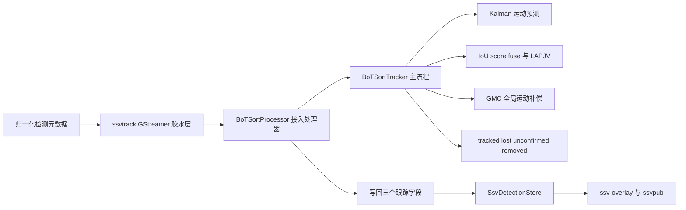
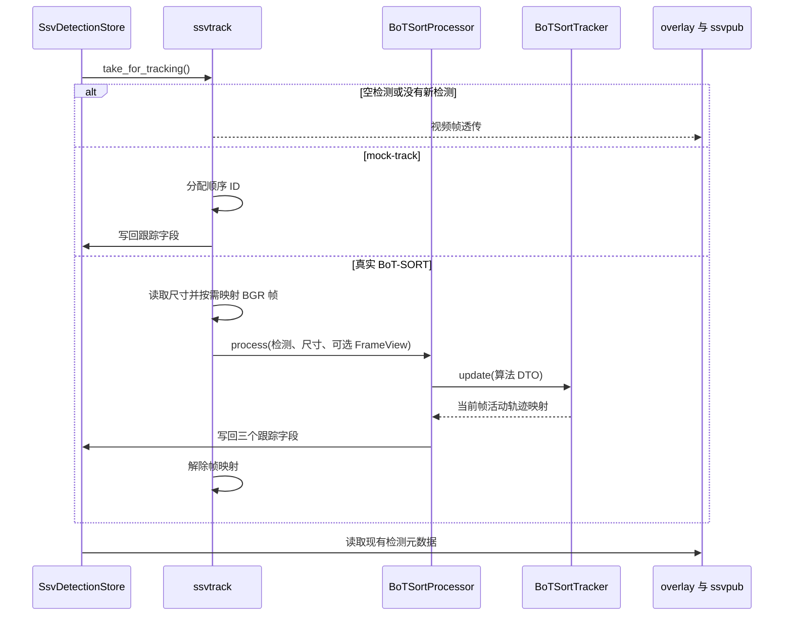

# T2 使用 BoT-SORT 替换 IoU 跟踪 spec

## 1. 背景

当前 `gst/ssv-track` 的默认真实跟踪路径从基于 IoU 的简单跟踪器迁移为无 ReID 的 BoT-SORT Python 路径子集。原 IoU 跟踪器只能依靠相邻帧框重叠和简单生命周期规则维持 `track_id`，无法覆盖 Kalman 运动预测、低分检测续接、未确认轨迹管理以及全局运动补偿（GMC）等能力。

本 spec 汇总 BoT-SORT 迁移、算法一致性验证与修复、处理器封装的统一设计和验收结论，作为 `T2` 感知算法与元数据主线的当前基线。迁移不改变现有检测元数据、Redis detection 消息和下游消费者契约。

## 2. 目标

1. 将 `ssvtrack` 默认真实跟踪路径从 IoU tracker 切换为无 ReID 的 BoT-SORT。
2. 在仓内原生 C++ 插件中实现 Kalman、IoU/score fuse 关联、LAPJV 分配、轨迹生命周期和 GMC。
3. 保持 `SsvDetection`、`SsvDetectionStore`、Redis detection JSON 以及 overlay、ssvpub、Agent 消费边界稳定。
4. 将 GStreamer 数据适配与 BoT-SORT 算法内核解耦，形成可独立测试的 `BoTSortProcessor`。
5. 通过固定 Python 基准、静态审查、确定性单测和插件回归证明已迁移路径的算法一致性。

## 3. 范围与非本阶段范围

### 3.1 本阶段范围

- `gst/ssv-track/botsort/` 中的 BoT-SORT 内核：Kalman、匹配、LAPJV、GMC、轨迹管理和处理器。
- `gst/ssv-track/gstssvtrack.cpp` 的插件属性、生命周期、帧映射、检测存储交互和 `mock-track` 旁路。
- 归一化 bbox 与像素 bbox 的边界转换。
- BoT-SORT 属性到 `TrackerConfig` 的配置快照。
- 插件到 `SsvDetectionStore` 的跟踪字段写回。
- 构建、单元测试、插件集成测试和可执行链路验证。

### 3.2 非本阶段范围

- ReID、embedding、跨摄像头跟踪和多摄像头轨迹关联。
- ByteTrack、DeepSORT 或其他跟踪算法，以及多算法动态切换工厂或策略接口。
- 轨迹级 Redis 消息、事件 schema、Agent 输入输出和 pipeline runner 职责调整。
- `SsvDetectionStore` 状态机、bbox 归一化格式和下游 detection 消息结构修改。
- 根据单条真实流确定 GMC 最终生产默认值。
- 修复与本算法无关的 TensorRT 运行时动态库部署问题。

## 4. 总体架构



### 4.1 模块职责

| 模块 | 职责 | 边界约束 |
| --- | --- | --- |
| `gst/ssv-track/gstssvtrack.cpp` | 定义和保存 GObject 属性；在 `start()` 生成配置快照；管理 tracker/processor 生命周期；读取检测、caps 和视频帧；负责 `GstVideoFrame` 映射；处理 `mock-track`；写回检测包。 | 不实现匹配、Kalman、轨迹池和 GMC 算法；不依赖下游 Redis 或事件逻辑。 |
| `botsort/botsort_types.*` | 定义 `Detection`、`FrameView`、`TrackState`、`TrackerConfig`、`UpdateResult` 和调试统计 DTO。 | 不依赖 GStreamer、Redis 或 `SsvDetectionStore`。 |
| `botsort/botsort_coordinates.*` | 在归一化坐标和像素坐标之间做无状态转换。 | 算法内核始终使用像素坐标；无效尺寸时保持源值并避免除零。 |
| `botsort/botsort_kalman.*` | 实现 8 维常速度模型、4 维观测投影、预测和更新。 | 只负责运动状态估计，不负责 ID 分配、过滤和匹配。 |
| `botsort/botsort_matching.*` | 计算 IoU cost、score fuse、类别约束、阈值过滤和 LAPJV 分配，并恢复输入顺序。 | 只返回匹配结果，不创建轨迹或维护生命周期。 |
| `botsort/botsort_gmc.*` | 实现 `none` 和稀疏光流 GMC，输出仿射变换并在不可用时回退 identity。 | 不拥有 `GstBuffer`；只处理图像视图或已注入的变换。 |
| `botsort/botsort_tracker.*` | 编排检测分流、Kalman、GMC、三阶段关联、轨迹生命周期、去重和结果输出。 | 不包含 GStreamer 和元数据存储逻辑。 |
| `botsort/botsort_processor.*` | 将 `SsvDetection` 适配为算法 DTO，调用 tracker，并将三项跟踪字段写回原始检测。 | 不包含 GStreamer 头文件，不管理 buffer/caps/frame 生命周期。 |

### 4.2 处理器接口

```cpp
class BoTSortProcessor {
public:
    explicit BoTSortProcessor(TrackerConfig config);

    void process(std::vector<SsvDetection>& detections,
                 int frame_width,
                 int frame_height,
                 const std::uint8_t* frame_data = nullptr,
                 std::size_t frame_stride = 0);

private:
    BoTSortTracker tracker_;
};
```

`SsvTrack` 继续使用 GObject C 结构体中的裸指针模式，但由 `BoTSortTracker*` 改为 `BoTSortProcessor*`。插件在 `start()` 创建 processor，在 `stop()` 删除并置空；`mock-track=true` 时不创建 processor。

## 5. 配置与属性

所有运行参数仍由 `ssvtrack` 的 GObject 属性公开。插件在 tracker 创建前通过配置快照函数一次性生成 `TrackerConfig`，处理器和 tracker 不保存第二份默认参数，也不解析 GObject 属性字符串。

| 属性 | 默认值 | 作用 |
| --- | ---: | --- |
| `track-thresh` | `0.5` | 跟踪置信度参考线，主要用于 `occluded` 标记，不负责检测过滤。 |
| `track-low-thresh` | `0.1` | 最低保留分数。`score <= low` 的检测丢弃。 |
| `track-high-thresh` | `0.6` | 高低分界线。`score > high` 进入第一阶段，其余保留检测进入第二阶段。 |
| `new-track-thresh` | `0.7` | 未匹配检测创建新轨迹的最低分数，等于阈值允许创建。 |
| `match-thresh` | `0.8` | 第一阶段关联代价上限。 |
| `track-buffer` | `30` | lost 轨迹保留帧数。 |
| `frame-rate` | `30` | 用于按帧率调整轨迹生命周期。 |
| `gmc-method` | `sparse-opt-flow` | GMC 方法，支持稀疏光流和 `none`。 |
| `gmc-downscale` | `2` | GMC 估计前的图像缩放倍数。 |
| `enable-score-fuse` | `true` | 是否将检测置信度融合到关联代价。 |
| `enable-class-constraint` | `false` | 是否要求轨迹类别与检测类别一致。 |
| `mock-track` | `false` | 显式联调旁路，按原逻辑分配顺序 ID。 |

阈值关系如下：

```text
score <= track-low-thresh
    → 丢弃

track-low-thresh < score <= track-high-thresh
    → 低分检测，进入第二阶段关联

score > track-high-thresh
    → 高分检测，进入第一阶段关联

未匹配高分检测且 score >= new-track-thresh
    → 创建新轨迹
```

`track-high-thresh` 只决定检测进入哪个关联阶段；`match-thresh` 决定关联代价是否可接受；`new-track-thresh` 只决定未匹配检测是否可以创建新轨迹，三者职责不可混用。

## 6. 每帧处理流程



处理步骤：

1. 插件从 `SsvDetectionStore` 取得本帧检测；空输入直接走透传路径，不伪造跟踪状态。
2. `mock-track=true` 时按现有旁路逻辑分配连续 ID，不运行 BoT-SORT。
3. 真实模式下，插件读取协商后的宽高，将归一化 bbox 转换为像素坐标。
4. 仅当 GMC 启用且帧映射成功时构造 `FrameView`；映射失败时传入空帧，处理器调用无帧更新路径。
5. tracker 依次完成检测过滤、Kalman 预测、GMC、三阶段关联、轨迹状态更新、去重和新轨迹创建。
6. 处理器按 `input_index` 恢复原始检测顺序，只写回 `track_id`、`track_state`、`occluded`。
7. 插件解除帧映射并将检测包写回 `SsvDetectionStore`。

## 7. BoT-SORT 算法流程

### 7.1 Kalman

每条 `TrackRecord` 保存 8 维状态、`8×8` 协方差以及初始化信息。观测使用中心点、宽、高和纵横比相关的 `xywh` 表示。Kalman 只负责预测和观测更新，不能直接决定轨迹 ID。

### 7.2 关联

关联代价使用 `1 - IoU`；启用 score fuse 时使用：

```text
fused_cost = 1 - (1 - iou_cost) * detection_score
```

匹配模块支持矩形代价矩阵、阈值过滤、输入顺序恢复和类别兼容性约束。C++ 内置 LAPJV dense 实现，运行时不依赖 Python；其许可证为 BSD-2-Clause，全文保存在 `gst/ssv-track/botsort/LAPJV_LICENSE.txt`。

### 7.3 三阶段关联

1. 将有效检测按严格阈值分为高分和低分集合。
2. 对 tracked 与 lost 轨迹的预测结果和高分检测执行第一阶段关联。
3. 对仍处于 tracked 的未匹配轨迹和低分检测执行第二阶段关联，低分检测只用于续接，不直接创建新轨迹。
4. 对 unconfirmed 轨迹和剩余高分检测执行确认阶段关联。
5. 对达到 `new-track-thresh` 的未匹配检测创建新轨迹。
6. 按 `track-buffer` 处理 lost 到 removed 的转换，并执行重复轨迹去重。

### 7.4 GMC

GMC 用于修正场景整体运动，不替代目标级 Kalman 预测。当前实现支持稀疏光流和 `none`：

- 输入帧由插件映射为 BGR `FrameView`，GMC 不拥有 GStreamer 对象。
- 稀疏光流使用上一帧特征点跟踪当前帧，并在有效对应点足够时估计仿射变换。
- 无帧、特征不足、估计失败或变换退化时返回 identity warp，不中断 pipeline。
- 对已预测的 tracked、lost 和 unconfirmed 轨迹应用完整 8 维状态变换及协方差变换。

## 8. 算法一致性基准与已修复差异

固定 Python 基准如下：

| 项目 | 值 |
| --- | --- |
| 基准仓库 | `/mnt/work/BoT-SORT` |
| 基准分支 | `feat/python-to-cpp` |
| 基准提交 | `1f7d73314e9e14148fb4acf597997c7e5d0bb455` |
| 参考实现 | `tracker/bot_sort.py`、`tracker/kalman_filter.py`、`tracker/matching.py`、`tracker/gmc.py` |

仅对已迁移的无 ReID 路径作一致性承诺。确定性对照使用相同检测、配置和固定 warp，比较轨迹 ID、状态、bbox、8 维均值和协方差；GMC 图像特征估计本身不要求跨语言逐 bit 相同。

已确认并处理的差异：

| 编号 | 差异 | 处理结论 |
| --- | --- | --- |
| D1 | GMC 只变换 bbox，未变换完整 Kalman 状态和协方差。 | 已修复。按 `R8x8 = kron(I4, R)` 变换状态与协方差，再导出 bbox。 |
| D2 | 高低分阈值边界使用了非严格比较。 | 已修复。`score <= low` 丢弃，`score > high` 为高分，其余为低分。 |
| D3 | 内核结果使用原始检测 bbox，而 Python 使用 Kalman 更新后的 bbox。 | 已修复。内核输出使用更新后的状态 bbox；插件外部 bbox 契约仍不变。 |
| D4 | Hungarian 与 Python LAPJV 在并列最优解上的选择可能不同。 | 已通过固定版本 Python `lap==0.5.13` 对照，并将官方 BSD-2-Clause LAPJV dense 实现纳入 C++。 |
| D5 | sparse optical flow 在当前帧特征点不足时过早回退。 | 已修复。当前帧特征点只用于下一帧；当前 warp 由上一帧点的光流结果决定。 |

## 9. 数据契约与兼容性

BoT-SORT 不新增跨主线接口，以下字段保持原有语义：

| 字段 | 规则 |
| --- | --- |
| `track_id` | 活动轨迹从 `1` 起分配；未获得活动轨迹的检测保持 `-1`。 |
| `track_state` | 新建轨迹写 `SSV_TRACK_NEW`，已关联轨迹写 `SSV_TRACK_MATCHED`；lost/removed 不生成虚构检测。 |
| `occluded` | 继续沿用现有布尔字段和下游透传方式。 |
| bbox、类别、置信度 | 保持现有归一化 `x1y1x2y2`、`class_id`、`confidence` 语义。 |

`ssvpub` 的 Redis detection schema 不新增字段、不改变事件类型；overlay 和 Agent 无需修改解析逻辑。处理器不得修改下游可见 bbox、类别、类别名和置信度。

## 10. 测试与验收

### 10.1 必测场景

- 高分连续检测的首帧激活和后续 ID 复用。
- 低分检测仅通过第二阶段续接。
- 短暂丢失、重激活和 `track-buffer` 超时移除。
- 未确认轨迹的确认和移除。
- `track-low-thresh`、`track-high-thresh`、`new-track-thresh` 等值边界。
- 平移、旋转和缩放 GMC 对完整状态及协方差的影响。
- 多目标 ID、重复轨迹去重和输入顺序恢复。
- 坐标归一化与像素坐标往返精度。
- 插件属性、`mock-track`、`gmc-method=none` 和帧映射失败回退。
- 内核结果到 `track_id`、`track_state`、`occluded` 的写回。

### 10.2 验证命令

```bash
# 与 GitHub CI 一致的完整验证
bash -n ssv scripts/*.sh tests/*.sh
SSV_TENSORRT=disabled SSV_RTSP_URL='' SSV_REQUIRE_SMOKE=false ./ssv test

# C++ 构建和 Meson 测试
SSV_TENSORRT=disabled ./ssv build
meson test -C build
```

真实 RTSP、模型和 Redis 可用时，再执行有界链路验证；环境缺失时只报告未执行项，不将其与算法单测结果混淆。

### 10.3 验收标准

1. 默认真实路径不再实例化或调用 IoU tracker。
2. `BoTSortProcessor` 已接管检测转换、坐标适配和跟踪字段写回，且不依赖 GStreamer 生命周期对象。
3. D1、D2、D3、D5 的修复有对应确定性回归；D4 有固定 LAPJV 对照证据。
4. `SsvDetection`、`SsvDetectionStore`、Redis detection JSON 和下游消费者契约回归通过。
5. `./ssv build`、可执行的 Meson 测试和插件回归通过；TensorRT 动态库缺失等环境问题单独记录。
6. `mock-track` 仍可作为显式联调和 smoke 旁路，但不作为真实跟踪结果使用。

## 11. 当前结果与运行建议

迁移和处理器封装已经完成，BoT-SORT 默认路径能够在仓内运行并写回稳定的正整数 `track_id`。当前流和模型组合下，`gmc-method=none` 比稀疏光流更稳定，应作为排障和准生产验证的优先起点；最终生产默认值需要更多视频流回归后再确定。

排障顺序：

1. 使用 `gst-inspect-1.0` 确认 `ssvtrack` 插件可加载。
2. 使用 `./ssv build` 和 `meson test -C build` 排除构建及内核测试问题。
3. 确认 Redis 服务和 `ssvpub` 正常，再执行 `./ssv test`。
4. 在真实 RTSP 流上运行 `scripts/pipeline.sh --smoke --skip-build`。
5. 若 `track_id` 大量为 `-1`，先切换 `gmc-method=none`，再检查检测质量、阈值和输入流抖动。
6. 若 `mock-track=true` 正常而真实 BoT-SORT 不稳定，优先检查检测结果、阈值和视频帧，而不是 Redis 发布链路。

## 12. 第三方代码与许可

`gst/ssv-track/botsort/botsort_lapjv.cpp/.hpp` 来源于官方 `lap` 仓库的 LAPJV dense 实现，版本对应 `lap==0.5.13` 源码族，许可证为 BSD-2-Clause；许可证全文位于 `gst/ssv-track/botsort/LAPJV_LICENSE.txt`。Python `lap` 仅用于生成一致性测试基线，C++ 插件运行时不依赖 Python。

## 13. 变更影响

- 对插件调用方：现有属性和检测元数据字段保持兼容，真实跟踪算法内部替换为 BoT-SORT。
- 对下游发布方：Redis detection schema 不变，不需要同步修改 `ssvpub`、Agent 或 overlay。
- 对测试环境：建议关闭 TensorRT 执行 CI 级基础验证；若启用 TensorRT，必须确保运行时 `libnvinfer` 可被插件扫描器加载。
- 对运行参数：新增高低分阈值、新轨迹阈值和 GMC 参数，但不改变已有属性名称和语义。

## 14. 关联历史文档

本 spec 合并以下文档的有效内容，原文档保留作为历史记录：

- `docs/specs/2026-07-08-T2-BoT-SORT迁移说明.md`
- `docs/specs/2026-07-13-T2-BoT-SORT迁移与一致性验证-spec.md`
- `docs/specs/2026-07-14-T2-BoT-SORT算法一致性验证与修复-spec.md`
- `docs/specs/2026-07-15-T2-BoT-SORT处理器封装-spec.md`
