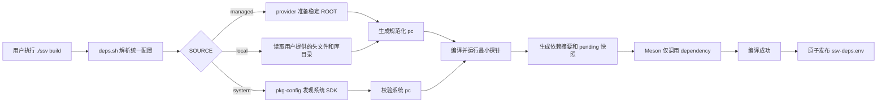

# T5 本地依赖管理收敛 spec

**日期：** 2026-07-20
**主线：** T5 工程集成与质量
**跨主线影响：** T1 实时视频链路与运行时、T2 感知算法与元数据
**状态：** 已实施并通过本地验证

## 1. 背景

仓库当前通过 `scripts/build.sh`、`scripts/lib.sh`、根 `meson.build` 和 `gst/tests/meson.build` 共同处理 ONNX Runtime、OpenCV、TensorRT 与 CUDA Runtime。三类 SDK 最终都链接到 Meson target，但准备过程存在多套规则：

- ONNX Runtime 同时存在系统 pkg-config、CMake package、固定 `.deps` 路径和脚本自动下载路径。
- OpenCV 默认由脚本下载固定二进制包，但开关、版本、安装目录和运行库路径分散在脚本与 Meson 中。
- TensorRT 同时存在 pkg-config、头文件扫描、`find_library()`、固定版本目录和 CUDA 路径猜测。
- 单元测试和运行脚本继续拼接固定 `LD_LIBRARY_PATH`，与实际构建解析结果可能不一致。
- ONNX Runtime 的 CPU/GPU 选择、OpenCV 的启停和 TensorRT 的启停使用不同命名模型。

这些差异使开发者需要记住每个 SDK 的特殊路径和回退顺序。本阶段将三类复杂 SDK 收敛为同一条依赖准备与消费链路，同时保留各 SDK 必要的来源差异。

## 2. 目标

1. 将 `./ssv build` 设为唯一的依赖准备入口。
2. 统一 ONNX Runtime、OpenCV、TensorRT + CUDA Runtime 的配置语义、脚本结构、pkg-config 输出、运行库解析和构建摘要。
3. 让 Meson 只消费已经准备好的 pkg-config，不下载 SDK、不扫描 `.deps`、不维护 CMake 或固定路径回退。
4. 让 build、run、test 和 inspect 使用同一份成功构建依赖快照。
5. 保持 ONNX Runtime CPU 和 OpenCV managed 路径可在支持的 Linux 环境中一键准备。
6. 完整保留 TensorRT 的 managed、system、archive 和 URL 使用能力，并使用与目标 engine 一致的真实 TensorRT SDK 完成 C++ 后端验收。
7. 不保留旧环境变量、旧 Meson option 或兼容别名。

## 3. 非本阶段范围

- 不把 GStreamer、yaml-cpp、hiredis、nlohmann-json 纳入 managed provider；这些基础依赖继续由系统或 `SSV_EXTRA_PKG_CONFIG_PATH` 提供。
- 不在 C++ 中执行下载、解包、模型转换或依赖准备。
- 不自动安装 CUDA、cuDNN、显卡驱动或 TensorRT SDK。
- 不替用户选择 TensorRT 版本，也不处理 NVIDIA 登录、Cookie、令牌或许可确认。
- 不在本机运行 ONNX Runtime GPU 推理；TensorRT 仅验证现有 engine 的反序列化与推理，不在插件内执行 ONNX 转 engine。
- 不实现依赖归档 SHA-256 校验。
- 不将依赖脚本扩展为通用发行版包管理器。

## 4. 统一心智模型

三类依赖共同遵循以下流程：



统一概念如下：

- `SOURCE` 回答依赖来源。ONNX Runtime 和 TensorRT 使用 `managed|system`；OpenCV 使用 `managed|local|system`。
- `MODE` 只回答可选能力是否启用；ONNX Runtime 是必需依赖，不设置 `MODE`。
- `ROOT` 表示仓库内的稳定依赖工作根目录。ONNX Runtime 和 TensorRT 只在 managed 来源使用；OpenCV 的 managed/local 共用同一个 ROOT，但原子替换边界分别收窄到 `managed/` 和 `local/lib/pkgconfig/`，不得替换整个 OpenCV ROOT。
- `VERSION` 只在能够由版本推导官方归档时公开；OpenCV 版本由项目默认清单管理，TensorRT 版本从 SDK 头文件读取。
- pkg-config 是构建与运行阶段唯一的 SDK 路径契约。

不同 SDK 可以采用不同来源，但最终都必须变成一个已经验证的标准 pkg-config 依赖。

## 5. 公开配置契约

### 5.1 默认配置

`.env.example` 显式展示以下默认配置，但保持为注释示例；实际优先级为：

```text
当前 shell > 仓库根 .env > scripts/deps/versions.sh
```

```dotenv
SSV_ONNXRUNTIME_SOURCE=managed
SSV_ONNXRUNTIME_VERSION=1.25.1
SSV_ONNXRUNTIME_ROOT=.deps/onnxruntime

SSV_OPENCV_SOURCE=managed
SSV_OPENCV_MODE=enabled
SSV_OPENCV_ROOT=.deps/opencv

SSV_TENSORRT_SOURCE=managed
SSV_TENSORRT_MODE=auto
SSV_TENSORRT_ROOT=.deps/tensorrt
```

构建依赖配置不写入 YAML。相对 `ROOT` 统一相对仓库根目录解释。

### 5.2 ONNX Runtime

| 配置 | 合法值 | 默认值 | 语义 |
| --- | --- | --- | --- |
| `SSV_ONNXRUNTIME_SOURCE` | `managed`、`system` | `managed` | SDK 来源 |
| `SSV_ONNXRUNTIME_VERSION` | `<semver>`、`<semver>-gpu` | `1.25.1` | managed 版本和包变体 |
| `SSV_ONNXRUNTIME_ROOT` | 安全的依赖子目录 | `.deps/onnxruntime` | managed 安装目录 |

版本格式严格限制为 `x.y.z` 或 `x.y.z-gpu`。无后缀表示 CPU 包，`-gpu` 表示 GPU 包。生成的 `onnxruntime.pc` 使用不带 `-gpu` 的标准版本，例如配置版本 `1.25.1-gpu` 对外报告 pkg-config 版本 `1.25.1`。

ONNX Runtime 是必需依赖，不提供 disabled 模式。system 来源最低支持版本为 `1.20`。

### 5.3 OpenCV

| 配置 | 合法值 | 默认值 | 语义 |
| --- | --- | --- | --- |
| `SSV_OPENCV_SOURCE` | `managed`、`local`、`system` | `managed` | SDK 来源 |
| `SSV_OPENCV_MODE` | `enabled`、`disabled` | `enabled` | GMC 是否启用 |
| `SSV_OPENCV_ROOT` | 安全的依赖子目录 | `.deps/opencv` | managed/local 共用的 OpenCV 工作根目录 |
| `SSV_OPENCV_INCLUDE_DIR` | 已存在目录 | 无 | local 头文件目录 |
| `SSV_OPENCV_LIB_DIR` | 已存在目录 | 无 | local 动态库目录 |

managed 默认版本为 OpenCV `4.10.0`，只在 `scripts/deps/versions.sh` 声明。当前 provider 使用预编译 `.deb` 作为内部实现，但不把 Ubuntu package revision 暴露为公开配置或依赖契约。未来可替换成项目组自维护的预编译包或源码构建产物，而不改变上述变量。

local 来源要求用户提供本机编译的 OpenCV `4.10.0` 头文件和动态库目录。`SSV_OPENCV_INCLUDE_DIR` 可指向 `include/opencv4`，也可指向其父级 `include`；provider 会规范化为包含 `opencv2/core.hpp` 的目录。`SSV_OPENCV_LIB_DIR` 必须直接包含项目所需动态库。`SSV_OPENCV_ROOT` 在 managed 与 local 模式中都表示统一 OpenCV 工作根目录；system 模式拒绝 ROOT，managed/system 模式也拒绝 local 专用路径。system 来源最低支持版本为 `4.5`。disabled 模式完全不准备、不发现、不探测 OpenCV。

### 5.4 TensorRT + CUDA Runtime

TensorRT 与 CUDA Runtime 对用户表现为一个依赖单元：

| 配置 | 合法值 | 默认值 | 语义 |
| --- | --- | --- | --- |
| `SSV_TENSORRT_SOURCE` | `managed`、`system` | `managed` | SDK 来源 |
| `SSV_TENSORRT_MODE` | `auto`、`enabled`、`disabled` | `auto` | 后端启停策略 |
| `SSV_TENSORRT_ROOT` | 安全的依赖子目录 | `.deps/tensorrt` | managed SDK 目录 |
| `SSV_TENSORRT_ARCHIVE` | 本地归档路径 | 无 | 用户明确提供的 SDK 归档 |
| `SSV_TENSORRT_URL` | 可直接下载的归档 URL | 无 | 用户明确授权下载 SDK |
| `CUDA_HOME` | CUDA Toolkit 根目录 | 自动发现 | managed TensorRT 的 CUDA 补充路径 |

不提供 `SSV_TENSORRT_VERSION`。provider 必须从 `NvInferVersion.h` 的版本宏读取实际版本，并写入 `nvinfer.pc`、依赖签名和构建摘要。

模式行为：

| SOURCE / MODE | 行为 |
| --- | --- |
| `managed + auto`，无 archive/URL | 只复用现有完整 ROOT；不可用时构建 stub，不下载 |
| `managed + auto`，显式 archive/URL | 用户已授权准备 SDK；准备失败则构建失败，不退回 stub |
| `managed + enabled` | 复用 ROOT 或使用显式材料准备；最终不可用则失败 |
| `managed + disabled` | 不准备、不探测，始终构建 stub |
| `system + auto` | 只检查系统 `nvinfer.pc`；不可用时构建 stub |
| `system + enabled` | 系统 pkg-config 和最小探针必须通过 |
| `system + disabled` | 不允许显式 SOURCE，直接使用 disabled 配置 |

TensorRT URL 必须能被 `curl -fL` 或 `wget` 直接下载。需要登录或许可确认时，用户先自行下载，再使用 `SSV_TENSORRT_ARCHIVE`。

## 6. 配置冲突和失败策略

配置采用严格失败，不建立隐式优先级：

- system 来源禁止显式 managed 专用的 `ROOT`、managed `VERSION`、`ARCHIVE`、`URL` 或 `CUDA_HOME`。
- disabled 模式禁止显式 SOURCE、ROOT、ARCHIVE、URL 等专用配置。
- TensorRT 不允许同时设置 `ARCHIVE` 和 `URL`。
- TensorRT auto 配置了 archive/URL 后，准备失败必须报错，不能静默改用 stub。
- managed ROOT 中存在无法识别为对应 SDK 的非空内容时立即报错，不覆盖。
- 路径支持普通空格，但拒绝换行和冒号，避免破坏 `KEY=value` 结果协议和 Linux 运行库路径列表。

旧变量和旧 Meson option 直接删除，不检测、不提示、不维护兼容层。

## 7. 脚本模块设计

目标结构固定为：

```text
scripts/
├── deps.sh
└── deps/
    ├── common.sh
    ├── versions.sh
    ├── onnxruntime-managed.sh
    ├── opencv-managed.sh
    └── tensorrt-managed.sh
```

`deps.sh` 使用固定 `source` 语句显式加载全部模块，不遍历目录或实现插件注册。

所有模块加载时无副作用：只定义常量和函数，不下载、不创建目录、不修改环境、不退出调用方。provider 使用返回码和统一错误函数报告失败。

### 7.1 deps.sh 公开接口

```bash
ssv_deps_prepare
ssv_deps_load_build
ssv_deps_load_runtime
```

- `ssv_deps_prepare`：解析配置、准备 SDK、验证 provider、导出本次 Meson 所需 `PKG_CONFIG_PATH`、生成 pending 快照和打印摘要。`build.sh` 只需调用该入口一次。
- `ssv_deps_load_build`：从已经解析的依赖结果恢复构建环境，供内部增量流程使用。
- `ssv_deps_load_runtime`：只读取成功的 `build/ssv-deps.env`，为 run、test 和 inspect 构造运行环境；绝不下载依赖。

不新增 `./ssv deps` 命令。

### 7.2 provider 接口

每个 managed provider 实现同结构的 prepare 和 validate 函数：

```text
ssv_<dep>_managed_prepare ROOT EXPECTED_VERSION
ssv_<dep>_managed_validate ROOT EXPECTED_VERSION
```

TensorRT 没有配置版本，`EXPECTED_VERSION` 为空，实际版本从 SDK 读取。

provider stdout 只允许固定三行结果：

```text
version=<实际版本>
pkgconfig_dir=<绝对目录>
runtime_dirs=<冒号分隔绝对目录>
```

日志写入 stderr。`deps.sh` 严格解析三行结果，不依赖跨 provider 的共享输出变量。provider 不直接修改全局 `PKG_CONFIG_PATH` 或 `LD_LIBRARY_PATH`。

### 7.3 common.sh 职责

公共模块统一提供：

- 平台与架构识别。
- 安全 ROOT 校验和路径规范化。
- 下载缓存、原子下载与一次坏缓存重试。
- tar/zip/deb 解包。
- 临时目录验证和同文件系统原子替换。
- pkg-config 生成、发现位置核对和版本检查。
- 运行库目录去重与系统目录识别。
- 最小 C++ 可加载探针。
- 依赖摘要、签名和 env 文件安全写入。

## 8. managed 安装与缓存

### 8.1 默认版本

`scripts/deps/versions.sh` 只保存用户可理解的项目默认版本：

```text
ONNX Runtime 1.25.1
OpenCV 4.10.0
```

OpenCV 当前 provider 的包文件名、下载 URL 和发行版内部 revision 映射留在 `opencv-managed.sh`，不进入公开版本清单。

### 8.2 缓存布局

- ONNX Runtime：`.deps/downloads/onnxruntime/<version>/`
- OpenCV：`.deps/downloads/opencv/<version>/`
- TensorRT URL：`.deps/downloads/tensorrt/<URL文件身份>/`
- TensorRT 本地 archive：直接读取，不复制到下载缓存。

三个依赖的下载文件继续统一归档在 `.deps/downloads/`，不分散到各 SDK ROOT。安装目录保持稳定，例如 `.deps/onnxruntime` 和 `.deps/opencv`。OpenCV 在唯一工作根目录中按 provider 隔离：

```text
.deps/opencv/
├── managed/                  # managed 解包结果和 opencv4.pc
└── local/
    ├── source/               # 本机源码检出
    ├── build/                # 本机构建目录
    ├── install/              # 本机安装结果
    └── lib/pkgconfig/        # local provider 生成的 opencv4.pc
```

仓库脚本不得再创建 `.deps/opencv-local` 或 `.deps/source/opencv`。升级默认版本或切换 provider 时不改变公开的 `.deps/opencv` 根目录，也不让 managed 的原子替换覆盖 local 源码和构建结果。

`./ssv clean` 继续只清理构建目录，不自动删除历史下载缓存。

### 8.3 下载行为

三类 provider 共用一个下载函数：

1. 优先使用 `curl -fL --retry 3`，无 curl 时回退 wget。
2. 下载到缓存同目录的临时文件，成功后原子改名。
3. 缓存存在时先复用，不访问网络。
4. 解包或完整性验证判定缓存损坏时，删除该缓存并重新下载一次。
5. 第二次仍失败则退出，不无限重试。

本阶段不做哈希校验。现场计算下载文件哈希不作为真实性校验。

### 8.4 复用与原子替换

managed ROOT 的复用必须同时通过：

- 配置版本或实际版本匹配。
- 标准 pkg-config 存在且指向该 ROOT。
- 必需头文件和动态库存在。
- 最小探针能够编译并运行。

已有安装子目录完整且匹配时完全跳过缓存和网络。需要更新时，在安装子目录相邻的同文件系统临时目录完成解包、pc 生成和全部验证，成功后才原子替换稳定安装子目录。OpenCV 只替换 `$SSV_OPENCV_ROOT/managed`，不得替换包含 local 工作材料的 `$SSV_OPENCV_ROOT`；失败时保留旧的可用目录。

不新增 `.ssv-dependency` 或其他安装元数据文件；归属、版本和完整性从 pc、头文件和动态库判断。非空 ROOT 无法确认属于当前依赖时不覆盖。

脚本拒绝把 `/`、用户主目录、仓库根目录、`.deps` 根目录等宽泛路径作为 managed ROOT。仓库级 `.deps/build.lock` 覆盖依赖准备、Meson 配置和编译全过程。

## 9. provider 特有规则

### 9.1 ONNX Runtime managed

- 根据 `x.y.z` 或 `x.y.z-gpu` 和当前架构推导官方 release 归档。
- CPU 与 GPU 安装路径都使用统一稳定 ROOT，默认 `.deps/onnxruntime`。
- 完整性检查包含 `onnxruntime_cxx_api.h`、`libonnxruntime.so` 和规范化 `onnxruntime.pc`。
- 最小 C++ 探针只通过 `pkg-config --cflags --libs --static onnxruntime` 编译，并读取 runtime 实际版本。
- GPU 变体不自动安装或管理 CUDA/cuDNN。provider 检查相关动态库是否可解析，真正 provider 初始化和推理能力仍由模型启动阶段验证。
- 删除 Python NVIDIA wheel 目录的自动扫描。用户需要通过系统动态链接器或显式 `LD_LIBRARY_PATH` 提供外部 GPU 运行库。

### 9.2 OpenCV managed 与 local

公开契约只声明 OpenCV `4.10.0`。当前 provider 的 `.deb` 获取方式是可替换内部实现。

provider 不依赖 apt 或 `dpkg-deb`：

1. 使用 `ar` 提取 `.deb` 容器。
2. 使用 `tar -xf` 读取 `control.tar.*` 和 `data.tar.*`。
3. 支持 tar 能处理的 zstd、xz、gzip 和 bzip2 压缩格式。
4. 解析 control 文件，校验包名、OpenCV 主版本和机器架构。
5. 解包后生成规范化 `opencv4.pc`。

项目公开链接模块为：

```text
core imgproc video calib3d features2d flann
```

`dnn` 不属于项目使用的 OpenCV API，但当前 `libopencv_video` 的 ELF `DT_NEEDED` 直接引用 `libopencv_dnn`，因此 provider 必须携带 dnn 运行时包，不下载 dnn 开发包，也不把 dnn 写入 `opencv4.pc` 的 `Libs`。

provider 使用 README 已要求的 `readelf` 获取所有 OpenCV `.so` 的 `DT_NEEDED`，验证 OpenCV 内部运行时闭包和宿主运行库。TBB、BLAS、LAPACK、glibc、libstdc++ 等通用库仍由宿主提供；provider 将宿主数学库链接参数写入 `opencv4.pc` 的 `Libs`，使 Ubuntu 中由 BLAS 提供的 CBLAS 和 Arch 中独立打包的 CBLAS 都能进入动态消费者的最终链接行。当前 dnn 运行包直接依赖特定 protobuf SONAME，provider 私有携带匹配的 protobuf 运行库，但不将其写入 `opencv4.pc` 的公开 `Libs`。

最小探针只通过 `pkg-config --cflags --libs --static opencv4` 编译，链接 `opencv_core` 并读取 `cv::getVersionString()`。探针实际运行结果作为基础 ABI 可加载性通过条件，不维护发行版白名单。

local provider 复用上述模块清单、ELF 闭包和版本探针，但不下载、复制或修改用户填写的 OpenCV 安装。它只在 `$SSV_OPENCV_ROOT/local/lib/pkgconfig` 原子生成项目私有的 `opencv4.pc`，其中 `includedir` 和 `libdir` 指向用户提供的规范化绝对路径。本机源码构建验收统一使用 `.deps/opencv/local/source`、`.deps/opencv/local/build` 和 `.deps/opencv/local/install`；managed 解包结果统一放在 `.deps/opencv/managed`，两种来源只共享 `.deps/opencv` 根目录，不共享可替换的安装子目录。头文件宏 `CV_VERSION` 与运行库 `cv::getVersionString()` 都必须精确为 `4.10.0`；只有 Python `cv2`、缺少任一必需模块、损坏的 ELF、未解析符号或其他版本均立即失败。用户安装中的其他未使用模块不参与校验。local include/lib 路径写入成功依赖快照和签名，运行库目录由 build、run、test 和 inspect 共同复用。

### 9.3 TensorRT managed

- TensorRT 和 CUDA Runtime 必须共同完整，统一由 `nvinfer.pc` 表达。
- provider 校验 `NvInfer.h`、`NvInferVersion.h`、`libnvinfer.so`、`cuda_runtime_api.h` 和 `libcudart.so`。
- SDK ROOT 可以是直接 SDK 根目录，也可以包含一层常见 `TensorRT-*` 目录；发现多个候选时必须报错，不自行选择。
- `CUDA_HOME` 只用于 managed TensorRT 无法从 SDK 或常规环境定位 CUDA 时补充；provider 必须跟随 `/usr/local/cuda` 和显式 `CUDA_HOME` 这类指向真实 Toolkit 的目录符号链接。
- provider 根据实际目录生成绝对 include/lib 参数，不硬编码 `x86_64-linux-gnu` 或 TensorRT 版本目录。
- `NvInferVersion.h` 的 `NV_TENSORRT_*` 可以是数字字面量，也可以是 Enterprise 归档中指向 `TRT_*_ENTERPRISE` 的宏别名；provider 必须解析有限别名链后得到数字版本。
- 真正启用时，最小探针只通过 `pkg-config --cflags --libs --static nvinfer` 编译和运行，并实际调用 `getInferLibVersion()` 和 `cudaRuntimeGetVersion()`，防止 linker `--as-needed` 在未引用符号时隐藏缺库问题。

本机真实验收使用与 `/home/tiger/Documents/agents/yolo-pose` 中目标 engine 一致的 TensorRT `11.1.0.106`。官方 CUDA 12 系列 Linux x86_64 归档为：

```text
https://developer.nvidia.com/downloads/compute/machine-learning/tensorrt/11.1.0/tars/TensorRT-Enterprise-11.1.0.106-Linux-x86_64-cuda-12.9-Release-external.tar.zst
```

本机实际组合为 CUDA 12.9 归档、CUDA Toolkit `13.2`、驱动 `610.74` 和 RTX 4060；该组合必须以实际编译和推理结果判定，不仅依赖版本推断。provider 仍从实际 `NvInferVersion.h` 读取版本，不把 URL 或版本变成项目默认配置。归档作为用户显式材料通过 `SSV_TENSORRT_URL` 准备，下载缓存和安装 ROOT 保持在被忽略的 `.deps` 下。验收包含 C++ 编译/加载探针、插件构建，以及目标 `.engine` 的反序列化和推理；无 SDK 时的 auto stub 与 disabled 路径仍保留。

本机验收结果：

- 官方归档下载大小为 `3457314267` 字节，通过 `zstd -t` 完整性检查，provider 解包后读取版本 `11.1.0`。
- `trtexec --getPlanVersionOnly` 确认 `/home/tiger/Documents/agents/yolo-pose/yolo26n.raw.engine` 由 `11.1.0.106` 创建；带 Ultralytics 元数据前缀的 `yolo26n.engine` 不用于 SSV 验收。
- `ssvinfer` 通过 Meson 构建真实 TensorRT 后端，`ldd -r` 可解析 `libnvinfer.so.11` 和 `libcudart.so.13`，无缺失库或未解析符号。
- 目标 engine 输入为 `1x3x640x640` FP32，输出为 `1x300x6` FP32。GStreamer 单帧管线日志确认 `runtime=tensorrt active-device=gpu provider=TensorRT`，完成推理并正常到达 EOS。
- `trtexec` 在随机输入、不计数据传输的短时验证中完成 `500` 次查询，平均 GPU latency 约 `1.85 ms`；该数字只用于证明运行时可执行，不作为生产性能承诺。

## 10. pkg-config 和 Meson 契约

### 10.1 pkg-config

managed provider 统一生成上游标准名称：

```text
onnxruntime.pc
opencv4.pc
nvinfer.pc
```

pc 使用绝对 `prefix`、`includedir` 和 `libdir`。system 来源只读取系统提供的 pc，不复制、不改写。

不创建 `build/deps/pkgconfig` 符号链接视图。`deps.sh` 将最终选定的真实 managed pkg-config 目录按确定顺序传给 Meson，并通过：

```bash
pkg-config --variable=pcfiledir <name>
```

确认命中的 pc 与配置来源一致。system 来源不得被仓库 managed pc 路径遮蔽；发现来源错配时直接失败。

### 10.2 Meson options

Meson option 统一为：

```text
-Dopencv_mode=enabled|disabled
-Dtensorrt_mode=auto|enabled|disabled
-Ddeps_runtime_path=<Linux 冒号分隔库目录>
```

默认值分别为 `enabled`、`auto` 和空字符串。旧 `-Dopencv`、`-Dtensorrt` 删除。

根 Meson 只保留标准依赖解析：

```meson
onnx_dep = dependency('onnxruntime', required : true)
opencv_dep = dependency('opencv4', required : opencv_enabled)
tensorrt_dep = dependency('nvinfer', required : tensorrt_required)
```

TensorRT auto 使用可选 dependency；未发现时编译 stub。Meson 不再使用 CMake method、`find_library()`、头文件扫描或固定 `.deps` 路径。

`build.sh` 通过 Meson 内建 `pkg_config_path` 传递解析后的 pc 目录，通过内部 `deps_runtime_path` 传递运行库路径。用户直接运行 `meson setup` 时必须自行提供 pkg-config 环境；Meson 不准备依赖。

## 11. 构建成功快照和运行环境

### 11.1 ssv-deps.env

`ssv_deps_prepare` 先生成：

```text
build/ssv-deps.env.pending
```

只有 Meson 配置和编译成功后，`build.sh` 才原子发布为：

```text
build/ssv-deps.env
```

构建失败时删除 pending，保留上一次成功快照。

文件采用可直接 source 的固定白名单 Bash 赋值格式，由 `printf '%q'` 安全生成。内容仅包括实际 source、mode、配置/实际版本、pkg-config 路径、非系统 runtime dirs、Meson option 和依赖签名；不记录 URL、凭据、完整用户环境或用户原始 `LD_LIBRARY_PATH`。

`ssv_deps_load_runtime` 在 source 前检查固定变量白名单和格式，不执行任意变量名或语句。内部路径和依赖签名使用规范化绝对路径；摘要对仓库内路径显示相对路径。

### 11.2 依赖签名

签名包括三类依赖的 source、mode、配置版本、实际版本、pcfiledir 和 libdir。每次 `./ssv build` 都重新解析依赖：

- 签名变化：执行 `meson setup --reconfigure`。
- 签名未变化：直接 `meson compile`。
- build 目录无效：重建 build 目录。

### 11.3 LD_LIBRARY_PATH

- managed 依赖的 pkg-config `libdir` 始终加入项目运行路径。
- system 依赖位于 `/usr/lib`、`/lib` 及其 multiarch 子目录时不额外加入。
- system 依赖位于 `/opt` 或其他自定义前缀时加入。
- 路径去重后前置到用户当前 `LD_LIBRARY_PATH`；不保存或覆盖完整用户原值。
- run、test 和 inspect 缺少成功 env 时明确要求先执行 `./ssv build`，不猜测 `.deps`。

## 12. 测试环境契约

删除 `gst/tests/meson.build` 中 OpenCV、ONNX Runtime 和固定 TensorRT 版本路径。Meson 配置通过 `deps_runtime_path` 获得统一运行库路径，因此以下两种入口都可用：

```bash
./ssv test
meson test -C build
```

Meson test 自身只保留 `GST_REGISTRY`、`GST_PLUGIN_PATH` 和项目内 `ssv-common` 路径；外部 SDK 路径来自依赖解析结果。

## 13. 构建摘要

依赖准备完成后统一输出简洁摘要，例如：

```text
ONNX Runtime  source=managed version=1.25.1 root=.deps/onnxruntime
OpenCV        source=managed mode=enabled version=4.10.0 root=.deps/opencv
TensorRT      source=managed mode=auto status=stub
```

system 来源显示 pkg-config 检出的实际版本和 libdir。摘要不输出冗长文件检查过程。

## 14. 平台边界

managed provider 本阶段支持 Linux `x86_64` 和 `aarch64`：

- ONNX Runtime 和 OpenCV 根据 `uname -m` 选择对应发布产物。
- TensorRT 从实际 SDK 目录解析 include/libdir，不硬编码架构路径。
- 其他架构或非 Linux 平台明确报告 managed provider 不支持，并建议使用 system 来源。

## 15. 测试与验收

### 15.1 离线脚本测试

新增 `tests/ssv_deps_test.sh`，通过临时 PATH 提供 fake `pkg-config`、curl、wget、ar、tar、readelf 和编译器；生产代码不增加 `SSV_TEST_*` 开关。

覆盖：

1. `shell > .env > versions.sh` 优先级。
2. ONNX Runtime `1.25.1` 与 `1.25.1-gpu` 严格解析。
3. managed/system 来源和 pcfiledir 来源核对。
4. OpenCV/TensorRT mode 行为。
5. 所有冲突配置和危险 ROOT 拒绝。
6. 下载缓存、一次坏缓存重试和原子替换。
7. provider 三行结果协议。
8. runtime dirs 去重和系统目录过滤。
9. pending/成功 env、白名单解析和依赖签名。
10. 构建摘要。
11. TensorRT auto 缺失、disabled、显式材料失败路径、Enterprise 版本宏别名和符号链接 `CUDA_HOME`。

`./ssv test` 在 C++ 构建前执行该离线测试，CI 通过同一入口覆盖。

### 15.2 本机集成验收

本机允许使用已有缓存或真实下载：

- ONNX Runtime CPU managed：完整下载/复用、探针、构建和测试。
- OpenCV managed：完整下载/复用、deb 提取、运行时闭包、探针、构建和测试。
- system 来源：完成配置与 Meson 发现验证；本机已有对应依赖时完成构建。
- ONNX Runtime GPU：只验证脚本与 fake provider 行为，不下载、不运行。
- TensorRT：下载并准备 `11.1.0.106` CUDA 12.9 Linux x86_64 归档，完成 C++ 探针、插件链接和与 `yolo-pose` 目标 engine 的运行时验证；同时保留 auto stub、disabled 和冲突错误验证。

### 15.3 CI

CI 显式设置：

```text
SSV_ONNXRUNTIME_SOURCE=managed
SSV_OPENCV_SOURCE=managed
SSV_OPENCV_MODE=enabled
SSV_TENSORRT_MODE=auto
```

CI 只缓存 `.deps/downloads/`，cache key 包含 `scripts/deps/versions.sh` 和 provider 脚本内容。每次 CI 都重新解包、生成 pc、运行探针并构建；不缓存安装 ROOT 或 build 目录。

## 16. 文档影响

实施时同步更新：

- `README.md`：统一配置模型、依赖矩阵、典型命令、managed/system 边界和 TensorRT 高级配置。
- `.env.example`：只保留新变量，显式展示三类依赖默认块。
- 既有 OpenCV 与推理运行时设计文档：通过本 spec 的“后续设计优先”说明处理旧脚本变量和旧 Meson option，不修改历史实现记录。

本 spec 在依赖准备、配置命名、pkg-config 和运行路径方面取代 `2026-07-16-T2-OpenCV-4.10本地依赖-spec.md` 与 `2026-07-07-T2-推理运行时解耦设计-spec.md` 的相关旧构建契约；推理后端和 GMC 算法设计本身保持不变。

## 17. 退出标准

1. 三类 SDK 都遵循 `配置 -> 来源 -> provider/system -> pkg-config -> 探针 -> Meson`。
2. `build.sh` 不再包含各 SDK 的下载、解包、固定路径或 pc 生成实现。
3. `lib.sh` 和 Meson 测试不再猜测依赖目录或扫描 NVIDIA wheel。
4. Meson 不再包含 CMake、头文件、`find_library()` 或固定 `.deps` 回退。
5. 默认 ONNX Runtime CPU + OpenCV managed 构建和测试通过。
6. 无 NVIDIA 环境下 TensorRT auto/disabled stub 路径通过。
7. `./ssv test`、直接 `meson test -C build`、run 和 inspect 使用同一成功依赖快照。
8. README、`.env.example`、CI 和 Bash 测试全部使用新契约。
9. 仓库中不存在旧环境变量或旧 Meson option 的活跃实现与用户说明。
