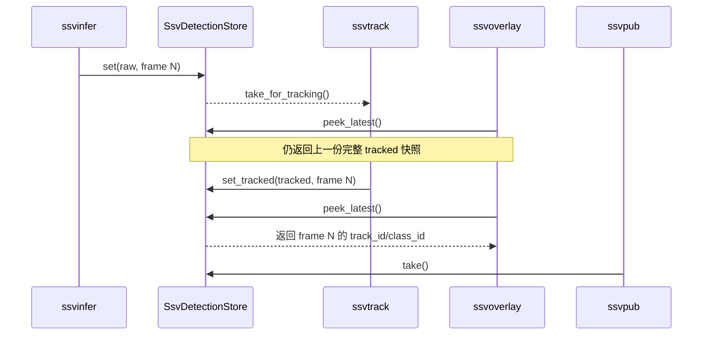

# T2 overlay 异步结果一致性 spec

## 背景

当前运行链路把视频分成显示分支和分析分支。`ssvoverlay` 在显示分支中通过
`SsvDetectionStore::peek_latest()` 非消耗读取结果；`ssvinfer` 则支持将推理放到
后台 worker 的 latest-frame 队列中。分析分支固定使用 `async=true` 时，推理完成和
同一分析 buffer 进入 `ssvtrack` 的顺序可能分离，ONNX Runtime、TensorRT 和不同
硬件速度会放大这个竞争窗口。

另外，`SsvDetectionStore::set()` 当前同时更新 tracker 的原始检测和 overlay 副本。
一个分析帧会先以 `track_id=-1` 发布，随后才由 `set_tracked()` 写回跟踪字段。显示
分支在两个写入之间读取时，就会看到同一检测框的标签在有无 track id 之间交替。

本阶段属于 `T2` 感知算法与元数据主线，并影响 `T1` 的 `scripts/pipeline.sh` 默认
pipeline。修复只收敛结果发布时序，不改变推理后端、模型配置或跟踪算法。

## 目标

1. 让 overlay 只观察完整的 tracked 快照，不观察 tracker 尚未处理的 raw detection。
2. 让项目默认分析链路中的 `ssvinfer` 与 `ssvtrack` 对同一个分析 buffer 顺序执行。
3. 保留 `ssvinfer` 通用 `async` 插件属性和 latest-frame worker，供其他明确需要实时丢帧
   语义的调用方使用。
4. 保证空的 tracked 结果也能发布，及时清除上一帧的 overlay 框。
5. 让上述行为与 ONNX Runtime CPU/GPU、TensorRT provider 无关。

## 范围

### 包含

- 修改 `gst/ssv-common/ssv_meta.cpp` 中 `SsvDetectionStore::set()` 的 overlay 发布
  行为。
- 保持 `set_tracked()` 作为唯一的 overlay 快照发布点。
- 修改 `scripts/pipeline.sh`，将项目分析分支显式设置为 `async=false`。
- 在 `gst/tests/test_ssv_meta.cpp` 和 `tests/ssv_cli_test.sh` 增加/调整回归断言。
- 更新元数据注释和本阶段验证文档。

### 非本阶段范围

- 不删除或重构 `ssvinfer` 的通用异步 worker。
- 不修改 ONNX Runtime、TensorRT、OpenCV 的下载、构建、链接或 provider 选择。
- 不调整 BoT-SORT 的 `track-thresh`、`new-track-thresh`、类别过滤或 ID 分配策略。
- 不把 YAML 中的 `tracking.*` 配置传递问题并入本次改动。
- 不改变 `SsvDetection` 字段、Redis 事件 schema 或 overlay 绘制格式。

## 行为契约

### `SsvDetectionStore`

| 调用 | `current_` | `overlay_current_` | 状态 |
| --- | --- | --- | --- |
| `set(raw)` | 写入并供 `take_for_tracking()` 消费 | 保持上一份完整 tracked 快照 | `HAS_DETECTIONS` |
| `set_tracked(tracked)` | 写入供 `take()` 消费 | 原子替换为本次 tracked 快照 | `HAS_TRACKS` |
| `set_tracked(empty)` | 写入空帧 | 发布空快照并清除旧框 | `HAS_TRACKS` |
| `peek_latest()` | 不改变 | 返回最近一次 `set_tracked()` 的副本 | 不变 |

`set(raw)` 在 `HAS_TRACKS` 状态下仍遵守现有保护规则，不覆盖尚未被
`ssvpub` 消费的跟踪结果。`set()` 的 raw detection 不再被视为可显示结果；即使
`ssvpub` 已经消费上一帧，overlay 也会继续显示上一份完整快照，直到下一次
`set_tracked()` 发布新结果或空结果。

### 项目默认 pipeline

`scripts/pipeline.sh` 的 `infer_props` 使用 `async=false`。分析分支已有独立的
`queue leaky=downstream`，因此同步推理只会阻塞分析分支，不会阻塞显示分支。插件
属性默认值和直接使用 `ssvinfer` 的行为保持不变。

## 数据流

## 接口影响

- **T2 内部接口：** `SsvDetectionStore` 的 overlay 快照发布时机收紧；公共结构和
  方法签名不变。
- **T1 pipeline 接口：** `scripts/pipeline.sh` 的默认 `ssvinfer` 属性从
  `async=true` 改为 `async=false`；命令行参数、YAML 键和退出码不变。
- **下游 T3/T4：** `ssvpub` 继续通过 `take()` 获取同一份 tracked 数据，Redis
  消息和 Agent 输入不变。

## 验收标准

1. 回归测试能复现：tracked frame 180 已发布并被 `take()` 消费后，raw frame 181
   写入不会改变 `peek_latest()` 中的 frame 180 和其 `track_id`；只有
   `set_tracked(frame 181)` 后才切换。
2. 空的 `set_tracked()` 会让 `peek_latest()` 返回空检测列表。
3. `tests/ssv_cli_test.sh` 断言项目 pipeline 使用 `async=false`，且仍保留插件
   异步能力的结构检查。
4. `./ssv build`、`meson test -C build --print-errorlogs`、`bash tests/ssv_cli_test.sh`
   和 `bash tests/ssv_deps_test.sh` 通过；环境缺失时在交付说明中明确记录。
5. 不同 provider 的代码路径均只经过同一个 `set()`/`set_tracked()` 发布契约。
