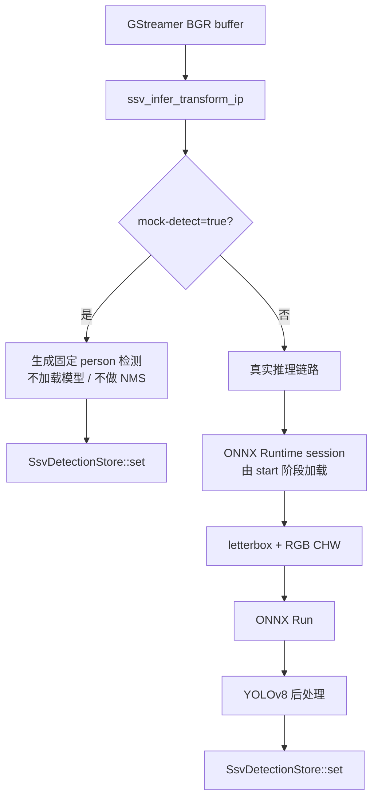
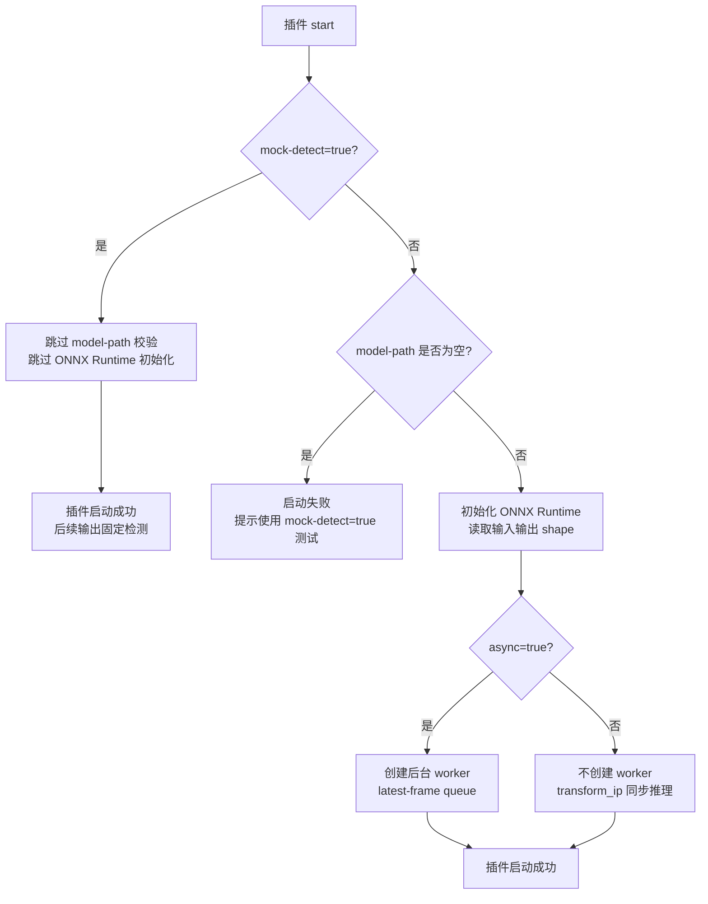
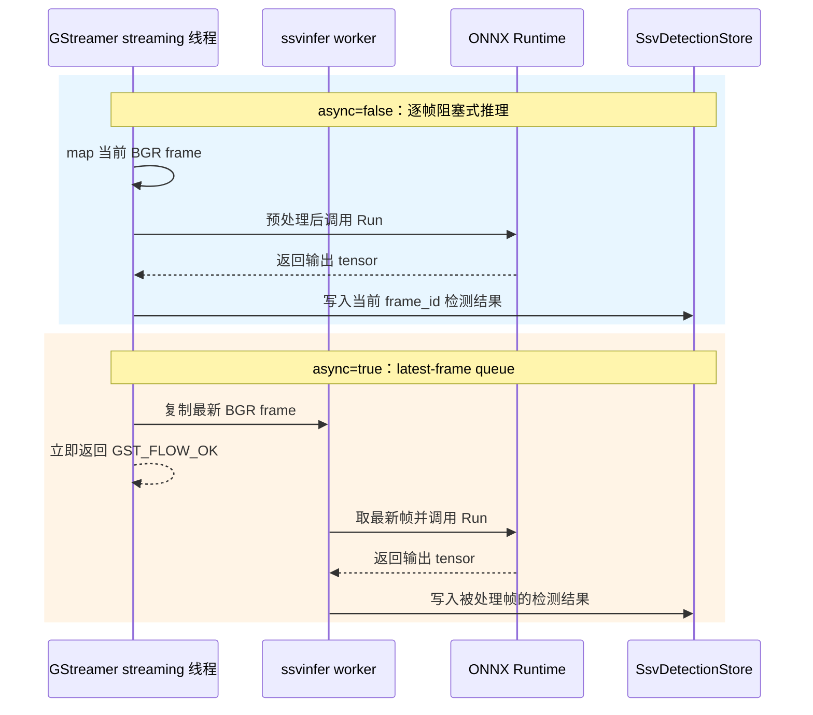
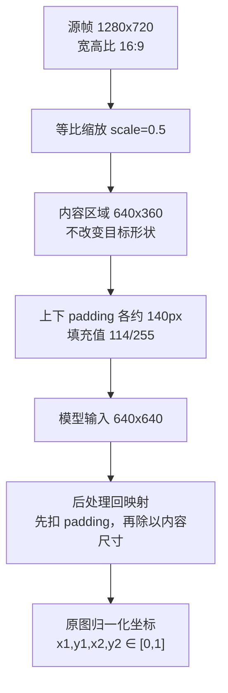
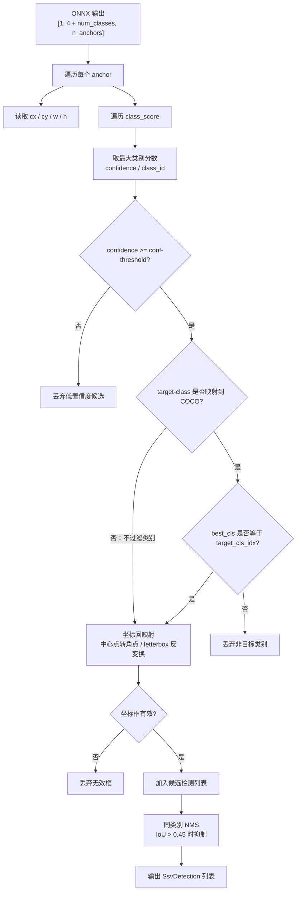
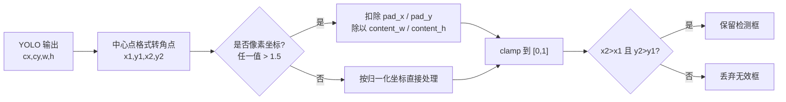
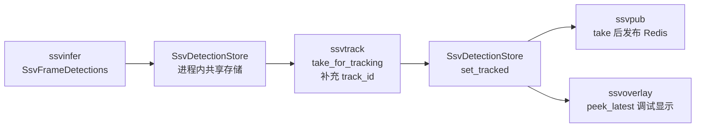

# YOLO 推理链路说明

本文档对应 `M1` 任务包 A，基于当前 `gst/ssv-infer/gstssvinfer.cpp` 梳理 `ssvinfer` 的 YOLO ONNX 推理链路。本文只描述现状、限制和后续接入注意事项，不改变代码行为。

## 结论摘要

当前 `ssvinfer` 是一个 `GstBaseTransform` 插件，输入和输出 caps 都是 `video/x-raw, format=BGR`。真实推理模式下，插件使用 ONNX Runtime 加载第一个输入和第一个输出，将 BGR 视频帧 letterbox 到模型尺寸，转换为 `float32`、`RGB` 通道顺序、`CHW` 布局的 `[1, 3, H, W]` 张量，再解析 YOLOv8 风格输出并写入 `SsvDetectionStore`。

当前稳定支持的后处理格式是 YOLOv8 导出的 `[1, 4 + num_classes, n_anchors]` 输出。代码能识别 YOLOv5 形状，但没有对应解析分支，因此现阶段不应把 YOLOv5 ONNX 视为已支持的真实输出格式。

默认工程行为偏向“实时链路不断流”：`async=true` 时，GStreamer 主线程只复制最新帧并立即返回，后台线程独立做推理；如果推理慢于视频帧率，中间帧会被覆盖。该行为适合单机实时预览和事件触发原型，但不适合要求逐帧检测结果完整对齐的离线评测。

## 总体数据流

当前真实推理的数据流如下：

```text
GStreamer BGR buffer
  -> ssv_infer_transform_ip
  -> GstVideoFrame map
  -> preprocess_bgr_to_chw
  -> Ort::Value input tensor [1, 3, model_h, model_w]
  -> Ort::Session::Run
  -> parse_yolov8
  -> apply_nms
  -> SsvDetectionStore::instance().set()
```

图形化链路如下：

```mermaid
flowchart LR
    buffer["GStreamer BGR buffer"] --> transform["ssv_infer_transform_ip"]
    transform --> map["GstVideoFrame map<br/>读取 width / height / stride / BGR 数据"]
    map --> preprocess["preprocess_bgr_to_chw<br/>letterbox / 归一化 / RGB CHW"]
    preprocess --> tensor["Ort::Value input tensor<br/>[1, 3, model_h, model_w]"]
    tensor --> run["Ort::Session::Run"]
    run --> parse["parse_yolov8<br/>解析候选框和类别分数"]
    parse --> nms["apply_nms<br/>同类别 IoU 抑制"]
    nms --> store["SsvDetectionStore::set<br/>写入检测元数据"]
```



mock 链路不经过 ONNX Runtime、预处理和 NMS：

```text
GStreamer BGR buffer
  -> ssv_infer_transform_ip
  -> fixed person detection
  -> SsvDetectionStore::instance().set()
```

真实链路和 mock 链路的分叉关系如下：



后续 `ssvtrack`、`ssvoverlay`、`ssvpub` 都通过 `SsvDetectionStore` 获取检测结果。本任务包只说明 `ssvinfer` 侧如何产生检测结果，不冻结跟踪、发布和事件规则。

## 插件入口和属性

`ssvinfer` 的 sink/src pad 都要求 `BGR`：

```text
video/x-raw, format=BGR
```

这意味着上游 pipeline 必须在进入 `ssvinfer` 前完成颜色格式转换。例如常见链路会在解码后接 `videoconvert ! video/x-raw,format=BGR`。如果上游没有协商到 BGR，插件 caps 不匹配，pipeline 会在 GStreamer 协商阶段失败或无法进入插件。

基础属性如下：

| 属性 | 默认值 | 说明 |
| --- | --- | --- |
| `model-path` | 空 | YOLO ONNX 模型路径；真实推理时必须设置 |
| `conf-threshold` | `0.5` | 最低类别置信度；只影响后处理过滤，不影响模型输出 |
| `target-class` | `person` | 只输出指定 COCO 类别；空字符串表示不过滤类别 |
| `mock-detect` | `false` | 跳过模型，生成固定 `person` 检测 |
| `async` | `true` | 后台线程处理最新帧，避免实时链路等待每帧推理 |

属性影响关系：

- `mock-detect=true` 优先级最高，会跳过 `model-path` 校验和 ONNX Runtime 初始化。
- `mock-detect=false` 时，`model-path` 为空会导致插件启动失败。
- `conf-threshold` 只在 YOLOv8 解析阶段使用；如果模型 shape 未进入 YOLOv8 后处理分支，该属性不会产生检测输出。
- `target-class` 只支持内置 COCO 类名映射，暂不支持外部 label map。
- `async=false` 时，推理在 `transform_ip` 当前线程完成；该模式更容易观察逐帧行为，但可能拖慢 pipeline。

属性对启动和运行路径的影响可以用下图概括：



## ONNX Runtime 加载

真实推理模式在 `ssv_infer_start` 中完成模型加载：

1. `mock-detect=true` 时直接跳过模型加载。
2. `model-path` 为空时启动失败，并提示测试场景使用 `mock-detect=true`。
3. 创建 `Ort::Env`，日志级别为 `ORT_LOGGING_LEVEL_WARNING`，环境名为 `ssv-infer`。
4. 创建 `Ort::SessionOptions`，设置 `SetIntraOpNumThreads(1)`，图优化级别为 `ORT_ENABLE_ALL`。
5. 创建 `Ort::Session`，并使用 CPU `Ort::MemoryInfo` 创建输入张量。
6. 读取第一个输入名称和第一个输出名称。
7. 从输入 shape 读取 `model_h = shape[2]`、`model_w = shape[3]`，即默认模型输入为 `NCHW`。
8. 输出 shape 为三维时，使用 `dim1 < dim2` 判定是否为 YOLOv8 风格输出。

输出 shape 判定规则：

| 判定 | 当前处理 |
| --- | --- |
| `out_shape.size() == 3` 且 `dim1 < dim2` | 视为 YOLOv8，`num_classes = dim1 - 4` |
| `out_shape.size() == 3` 且 `dim1 >= dim2` | 识别为 YOLOv5，`num_classes = dim2 - 5` |
| 其他 shape | 不解析检测结果 |

这里的判定是工程启发式，不是完整模型格式校验。它假设 YOLOv8 输出通常是 `[1, 84, 8400]` 这一类形状，第二维小于第三维；YOLOv5 常见输出是 `[1, 25200, 85]`，第二维大于第三维。对于经过特殊导出、动态 shape、已内置 NMS 的模型，单靠这个规则可能无法正确识别。

需要注意：

- 当前只读取第一个输入和第一个输出，不支持多输入、多输出模型。
- 当前没有检查输入数据类型，代码直接创建 `float` tensor。
- 当前没有处理动态输入维度，例如 shape 中存在 `-1` 的模型。
- 当前没有读取模型 metadata 或 label map。
- 当前真实后处理只在 `is_yolov8 == true` 且运行时输出 shape 仍为三维时执行。

## BGR 输入读取

同步和异步模式都会从 negotiated caps 生成 `GstVideoInfo`，再 map 当前 `GstVideoFrame`。插件读取：

- `width`
- `height`
- `stride`
- 第 0 平面的 BGR 字节数据

`stride` 是每行实际字节数，不一定等于 `width * 3`。GStreamer buffer 可能按对齐规则在每行末尾添加 padding，所以预处理读取每一行时必须使用 `src + sy * src_stride`。当前代码按 `sx * 3 + channel` 读取像素，因此它依赖 caps 已经是 3 字节 BGR，而不是 BGRx、RGB 或 planar 格式。

同步模式流程：

1. 当前 `transform_ip` 调用中 map 视频帧。
2. 直接预处理为模型输入 tensor。
3. 调用 `Ort::Session::Run`。
4. 解析输出并写入 `SsvDetectionStore`。
5. 返回 `GST_FLOW_OK`。

异步模式流程：

1. 当前 `transform_ip` 调用中 map 视频帧。
2. 将完整 BGR 平面复制到 `SsvInferFrame::bgr`。
3. 用 `ssv_infer_store_latest_frame` 替换待处理帧。
4. 主线程立即返回 `GST_FLOW_OK`。
5. 后台线程取最新帧执行预处理、推理和后处理。

异步模式的关键语义是 latest-frame queue：队列深度实际为 1。新帧到来时会删除尚未处理的旧帧，只保留最新帧。这降低实时链路延迟，但会造成检测结果和输入帧不是一一对应。

同步和异步路径的差异如下：



## frame_id 和 source_id

`frame_id` 在 `ssv_infer_transform_ip` 开始处递增。同步模式下，该 `frame_id` 对应当前帧的推理结果。异步模式下，`frame_id` 随复制给后台线程的帧一起保存；如果中间帧被覆盖，被覆盖帧不会产生真实推理结果。

`source_id` 当前固定为 `pipeline-0`。这对单路视频原型足够，但还不能区分多路输入。后续 T1/T3 如果引入多路源、事件消息或证据路径，需要把真实 source 标识从 pipeline 配置传入或写入元数据。

## letterbox 预处理

预处理函数 `preprocess_bgr_to_chw` 使用等比缩放：

```text
scale = min(model_w / source_w, model_h / source_h)
new_w = int(source_w * scale)
new_h = int(source_h * scale)
pad_x = (model_w - new_w) / 2
pad_y = (model_h - new_h) / 2
```

目标张量先整体填充为 `114 / 255`，对应 YOLO 常见 letterbox padding 值。随后按最近邻方式从源图采样并写入模型输入区域。

举例：如果源帧是 `1280x720`，模型输入是 `640x640`：

```text
scale = min(640 / 1280, 640 / 720) = 0.5
new_w = 640
new_h = 360
pad_x = 0
pad_y = 140
```

模型输入中间的 `640x360` 区域来自原图，上下各有约 `140` 像素 padding。后处理从模型坐标回到原图坐标时，必须扣除同样的 padding，否则检测框会在竖直方向偏移。

`1280x720 -> 640x640` 的 letterbox 关系如下：



当前实现细节：

- `new_w` 和 `new_h` 通过强制转换为 `int` 截断，不做四舍五入。
- `pad_x` 和 `pad_y` 是整数，左右或上下 padding 在奇数差值时可能相差 1 像素。
- resize 使用最近邻采样：`sx = int(x / scale)`，`sy = int(y / scale)`。
- 没有使用双线性插值、OpenCV、GStreamer scaler 或硬件加速。
- padding 区域直接是归一化后的 `114 / 255`，不是先填充 `uint8 114` 再统一转换，但数值等价。

这些细节对普通 smoke 足够，但如果后续要对齐 Ultralytics Python 推理结果，需要注意 resize 插值、rounding 和 padding 分配可能带来少量坐标差异。

## CHW 和通道顺序

源帧是 BGR 字节序，每个像素按 `B, G, R` 读取。写入模型张量时转换为：

```text
dst[0, :, :] = R
dst[1, :, :] = G
dst[2, :, :] = B
```

因此输入张量实际是 `RGB` 通道顺序、`CHW` 布局、`float32` 类型，数值范围为 `[0, 1]`，shape 为：

```text
[1, 3, model_h, model_w]
```

这说明 `BGR 输入` 和 `RGB 模型输入` 不是矛盾的：GStreamer caps 要求上游提供 BGR buffer，`ssvinfer` 在预处理阶段完成 BGR 到 RGB 的通道重排。模型如果是按 BGR 或不同均值方差训练的，当前预处理不适配。

当前没有做以下预处理：

- mean/std 标准化。
- `0..255` 原始浮点输入。
- `NHWC` 布局。
- 半精度 `float16` 输入。
- 批量推理，batch 固定为 `1`。

## ONNX Runtime 推理调用

同步和异步最终都调用同一类 ONNX Runtime API：

```text
Ort::Value::CreateTensor<float>(
  mem_info,
  input_tensor.data(),
  tensor_size,
  [1, 3, model_h, model_w],
  4
)
```

随后调用：

```text
ort_session->Run(
  Ort::RunOptions{nullptr},
  input_names,
  &input_ort,
  1,
  output_names,
  1
)
```

代码只请求一个输出，并直接用 `GetTensorData<float>()` 读取第一个输出 tensor。若模型输出不是 float tensor，或者输出已经是经过 NMS 的二维检测表，当前代码不会正确解析。

推理异常不会让 pipeline 崩溃。`Ort::Exception` 会被捕获，插件记录 warning，写入空检测结果，然后返回 `GST_FLOW_OK`。

## YOLOv8 输出解析

当前解析函数是 `parse_yolov8`，假设输出为：

```text
[1, 4 + num_classes, n_anchors]
```

每个 anchor 读取：

```text
cx = data[0 * n_anchors + i]
cy = data[1 * n_anchors + i]
w  = data[2 * n_anchors + i]
h  = data[3 * n_anchors + i]
class_score[c] = data[(4 + c) * n_anchors + i]
```

也就是说，当前解析假设输出是 channel-first 的二维表：先排列所有 anchor 的 `cx`，再排列所有 anchor 的 `cy`，以此类推。它不支持 `[1, n_anchors, 4 + num_classes]` 这种 layout，除非模型导出阶段已经做了 transpose。

代码没有单独读取 objectness，因此置信度直接取最大类别分数。这个行为符合常见 YOLOv8 导出输出，但不适合 YOLOv5 的 `objectness * class_score` 后处理方式。

YOLOv8 输出解析和过滤顺序如下：



## 置信度过滤

每个 anchor 先遍历所有类别，选择最高类别分数：

```text
confidence = max(class_score)
class_id = argmax(class_score)
```

如果 `confidence < conf-threshold`，该候选框被丢弃。默认阈值为 `0.5`。

过滤顺序是先找最大类别分数，再做阈值判断和类别过滤。这意味着对于默认 `target-class=person`：

1. 某个 anchor 的最高类别如果是 `car`，即使 `person` 分数也超过阈值，该 anchor 仍会被分配为 `car`。
2. 随后类别过滤发现它不是 `person`，该 anchor 被丢弃。

换句话说，当前逻辑不是“取目标类别分数并判断是否超过阈值”，而是“先取全类别最高分，再判断这个最高类别是否等于目标类别”。这与很多通用 YOLO 后处理一致，但后续如果只关心安全帽类别，需要确认是否接受这种策略。

## 类别过滤

`target-class` 通过内置 COCO 80 类名称表转换为类别索引。默认值为 `person`，因此默认只输出 COCO `class_id=0`。

过滤规则：

- `target-class` 为空字符串时，`target_cls_idx = -1`，不过滤类别。
- `target-class` 命中 COCO 名称时，只保留该类别。
- `target-class` 未命中 COCO 名称时，索引为 `-1`，实际效果是不过滤类别。

这一点对安全帽模型预研很重要：当前没有外部 label map，不能用自定义类别名直接做 `target-class` 过滤。自定义模型只能依赖 `class_<id>` 输出命名，或后续改造类别表加载机制。

对 M1 后续任务包的影响：

- 任务包 C 如果训练 `helmet` / `no_helmet` 模型，不能仅通过 `target-class=helmet` 获得过滤效果。
- 任务包 B 如果冻结元数据契约，需要说明 `class_name` 可能来自 COCO，也可能是 fallback 的 `class_<id>`。
- 任务包 D 如果做真实模型 smoke，需要记录使用默认 COCO `person` 还是关闭类别过滤。

## 坐标回映射

候选框从中心点格式转为角点格式：

```text
x1 = cx - w / 2
y1 = cy - h / 2
x2 = cx + w / 2
y2 = cy + h / 2
```

代码通过以下条件判断输出是否像素坐标：

```text
cx > 1.5 || cy > 1.5 || w > 1.5 || h > 1.5
```

如果是像素坐标，会扣除 letterbox padding 并除以缩放后内容尺寸，得到原图归一化坐标：

```text
x = (x_in_model - pad_x) / content_w
y = (y_in_model - pad_y) / content_h
```

如果不是像素坐标，则直接按归一化中心点坐标处理。最终所有坐标都会 clamp 到 `[0, 1]`，并丢弃 `x2 <= x1` 或 `y2 <= y1` 的无效框。

当前坐标处理有几个边界需要注意：

- 像素坐标判断是启发式，依赖值是否大于 `1.5`。如果模型输出归一化坐标但数值异常超过该阈值，会被错误地按像素坐标回映射。
- 对归一化坐标分支，代码没有扣除 letterbox padding，假设模型输出已经是原图归一化坐标或无需回映射。
- clamp 会把超出画面的框截到图像边界，这有利于下游稳定处理，但会隐藏部分坐标越界问题。
- 无效框会被直接丢弃，下游看不到这些候选。

对 overlay 和事件侧而言，当前输出坐标已经是归一化角点坐标，后续画框或裁剪证据时需要乘以实际帧宽高。

坐标从模型空间回到原图空间的关系如下：



## NMS

`apply_nms` 在所有候选框收集完成后执行：

- 先按 `confidence` 降序排序。
- 只在相同 `class_id` 之间计算 IoU 抑制。
- IoU 阈值固定为 `0.45`。
- 最多保留 `50` 个检测结果。

IoU 计算使用归一化坐标，因此与输入分辨率无关。抑制条件是：

```text
candidate.class_id == selected.class_id
&& IoU(candidate, selected) > 0.45
```

这意味着不同类别即使框高度重叠，也不会互相抑制。对于 COCO `person` 单类别过滤场景，这基本等价于只在人框之间做 NMS。对于关闭类别过滤或安全帽多类别模型，`helmet` 和 `no_helmet` 如果预测框重叠，当前 NMS 不会互相抑制。

当前 NMS 阈值和最大检测数不是插件属性。如果后续需要针对密集施工现场、多人近距离遮挡或安全帽小目标调参，需要把这些值变成配置项或插件属性。

## 输出元数据

每个有效检测写入 `SsvDetection`：

| 字段 | 当前来源 |
| --- | --- |
| `class_name` | COCO 名称；超出 COCO 范围时为 `class_<id>` |
| `confidence` | 最大类别分数 |
| `x1, y1, x2, y2` | 原图归一化坐标，范围 `[0, 1]` |
| `class_id` | YOLO 类别索引 |
| `track_id` | 推理阶段不设置，保持默认值 |

`SsvFrameDetections` 当前设置：

| 字段 | 当前来源 |
| --- | --- |
| `frame_id` | `ssvinfer` 内部递增 |
| `source_id` | 固定为 `pipeline-0` |
| `detections` | 后处理输出的检测列表 |

结果通过 `SsvDetectionStore::instance().set()` 交给后续 `ssvtrack`、`ssvoverlay` 或 `ssvpub` 使用。

输出元数据的下游消费关系如下：



当前 `SsvDetectionStore` 是进程内共享存储，不是附着在每个 `GstBuffer` 上的 GStreamer meta。它适合当前单路原型，但对严格逐帧同步和多路隔离有天然限制。后续如果要支持多路输入或事件证据精确对齐，需要重新评估结果存储方式或在元数据中携带 source/frame 关联。

## mock-detect 链路

`mock-detect=true` 时不加载模型，每帧生成一个固定检测：

```text
class_name = person
confidence = 0.95
x1 = 0.1
y1 = 0.2
x2 = 0.5
y2 = 0.8
class_id = 0
```

该链路用于无模型环境的基础回归，不验证 ONNX Runtime、letterbox、CHW、类别过滤或 NMS。它可以验证以下内容：

- 插件能被 GStreamer 注册和创建。
- pipeline 能通过 `ssvinfer`。
- `SsvDetectionStore` 能写入检测结果。
- 下游 `ssvtrack`、`ssvoverlay`、`ssvpub` 能看到基本检测结构。

它不能证明真实模型加载成功，也不能证明坐标、类别和置信度后处理正确。

## 错误处理和降级行为

当前错误处理偏向保持 pipeline 可继续运行：

| 场景 | 当前行为 |
| --- | --- |
| `mock-detect=true` | 跳过模型加载，插件可启动 |
| 真实模式 `model-path` 为空 | `start` 返回 `FALSE`，pipeline 启动失败 |
| ONNX Runtime 加载异常 | 记录 error，`start` 返回 `FALSE` |
| 推理时 `Ort::Exception` | 记录 warning，写入空检测，返回 `GST_FLOW_OK` |
| 无法读取 caps | 写入空检测，返回 `GST_FLOW_OK` |
| 无法 map 视频帧 | 写入空检测，返回 `GST_FLOW_OK` |
| 非 YOLOv8 输出 | 不解析检测，写入空检测 |

这类降级方式能减少运行时崩溃，但也可能让“模型不匹配”表现为“没有检测”。调试真实模型时应同时打开 GStreamer 日志，关注 `YOLOv8 model`、`YOLOv5 model`、`model loaded`、`inference failed` 等日志。

## 当前限制

1. 真实后处理只支持 YOLOv8 风格 `[1, 4 + num_classes, n_anchors]` 输出。
2. YOLOv5 shape 虽被识别，但没有解析输出，因此不会产生真实检测。
3. 只读取第一个模型输入和第一个模型输出。
4. 输入假设为 `NCHW`，没有处理动态输入维度或 `NHWC` 模型。
5. 输入 tensor 固定为 `float32`、batch `1`、RGB、`0..1` 归一化。
6. 类别名称表固定为 COCO 80 类，不支持外部 label map。
7. `target-class` 未命中 COCO 名称时等价于不过滤类别。
8. NMS 阈值 `0.45` 和最大检测数 `50` 是硬编码。
9. `source_id` 固定为 `pipeline-0`，尚未接入多路输入配置。
10. `async=true` 会丢弃中间帧，只保证处理最新帧，不保证每帧都有对应真实推理结果。
11. 检测结果通过进程内 `SsvDetectionStore` 流转，不是逐 buffer 附着的 GStreamer meta。
12. 当前测试主要覆盖 mock、插件注册和元数据流转，不覆盖真实 ONNX 输出数值正确性。

## 后续任务包注意事项

任务包 B 需要基于本文继续冻结 `ssv_meta` 检测字段契约，尤其是：

- `x1, y1, x2, y2` 是否正式规定为原图归一化角点坐标。
- `class_name` 在 COCO 和自定义模型下的语义。
- `frame_id`、`source_id`、`track_id` 的默认值和跨插件传递规则。

任务包 C 做安全帽训练最小闭环时，需要明确：

- 模型导出是否保持 YOLOv8 `[1, 4 + num_classes, n_anchors]` 输出。
- label map 的类别顺序如何映射到 `class_id`。
- 是否需要在 `ssvinfer` 中支持外部 label map 和自定义 `target-class`。
- 训练预处理是否与当前 `RGB`、`0..1`、letterbox、无 mean/std 的实现一致。

任务包 D 做 mock/真实模型 smoke 时，需要明确：

- mock smoke 只能覆盖插件和元数据通路。
- 真实模型 smoke 应记录模型文件路径、输入视频源、是否显示、`target-class` 设置和预期检测类别。
- 如果使用 COCO `yolov8n.onnx`，默认 `target-class=person` 是合理 smoke。
- 如果使用自训练安全帽模型，需要避免误以为 `target-class=helmet` 已生效。

## 验收

任务包 A 的验收命令：

```bash
./ssv build
meson test -C build
```

真实 `yolov8n.onnx` 的 smoke、模型文件依赖和视频源依赖由 `M1` 任务包 D 继续整理。
